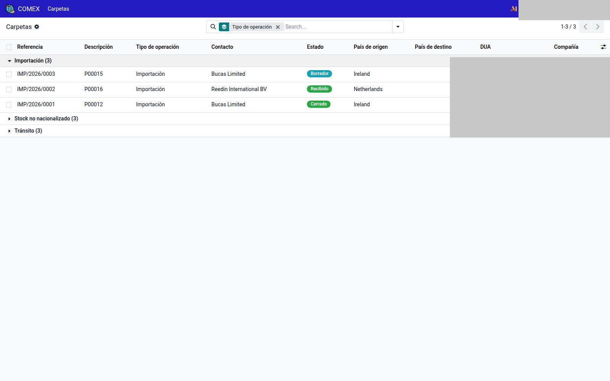
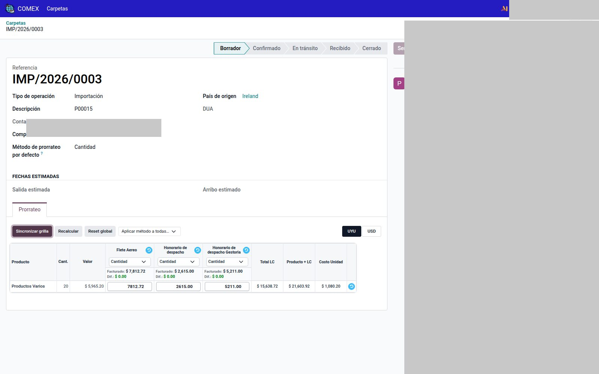
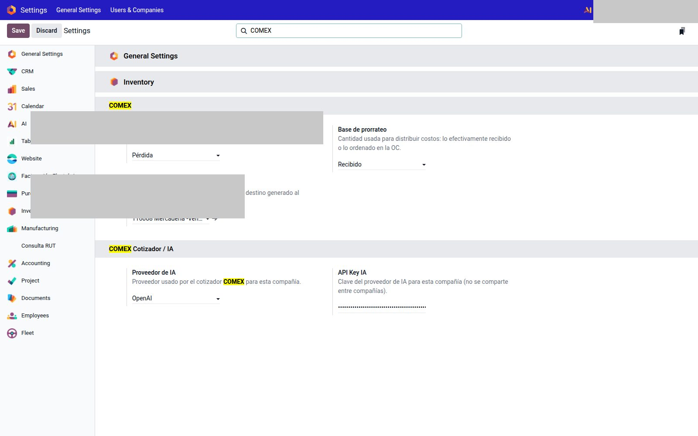

# Carpetas COMEX

Módulo `comex`. Una carpeta = una operación de **importación** o **exportación**.

`COMEX → Carpetas`.

---

## Crear y avanzar

Lo habitual: desde la OC (importación), la OV (exportación) o una factura de gasto LC → **Generar carpeta COMEX** (crear nueva o unirse a una existente). También `COMEX → Carpetas` → **Nuevo**.

1. Tipo importación o exportación, descripción, países, fechas estimadas.
2. DUA con la máscara del país (`COMEX → Configuración → DUA por país`).
3. **Confirmar** (grupo **Administración COMEX**).
4. **En tránsito.**
5. Importación: **Recibido**. Exportación: **Entregado**.
6. Pestaña **Prorrateo**: sincronizar / recalcular hasta que **Dif.** de cada costo capitalizable sea 0.
7. **Cerrar** — genera el asiento de costo en destino (cuenta puente de Ajustes).
8. **Cancelar** solo en borrador o confirmado.

Estados importación: Borrador → Confirmado → En tránsito → Recibido → Cerrado.  
Estados exportación: … → Entregado → Cerrado.

---

## Qué se engancha

Una factura de proveedor con costo en destino no se postea sin carpeta (o el check **No pertenece a operación COMEX**).

`COMEX → Facturas sin carpeta` (admin): el pendiente a enganchar. Smart buttons: OC, OV, facturas, recepciones, costo en destino.

Pestaña **Prorrateo**: matriz producto × costo. La base (cantidad recibida vs pedida) se elige en `Ajustes → Inventario → COMEX`.

Ahí también:

- **Faltante en recepción:** pérdida o backorder, según la compañía.
- **Cuenta puente LC COMEX:** crédito del asiento al cerrar.

Al cerrar, si el período contable está cerrado, Odoo avisa (wizard). Factura duplicada en la misma carpeta: aviso, no se silencia.

No copies la cuenta puente ni el DUA de otra empresa.
