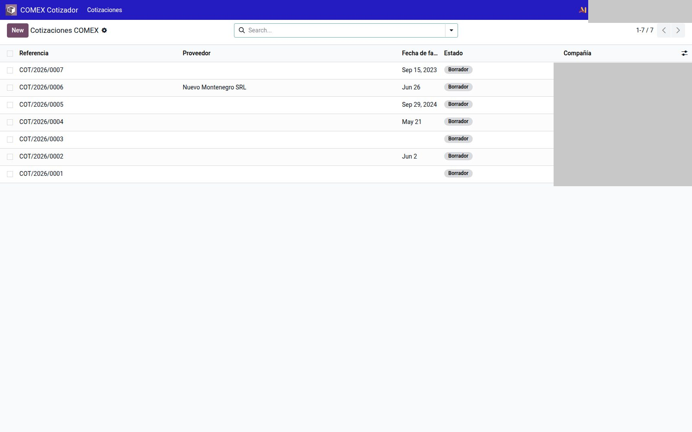
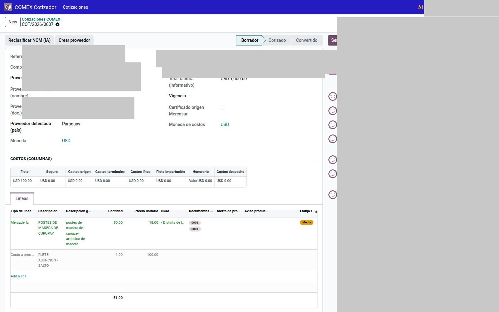
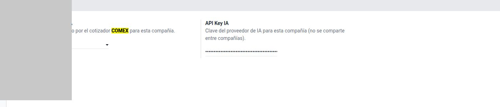

# Cotizador COMEX

Módulo `comex_quote` (en implementación: el circuito de UI ya está; la IA y el catálogo NCM se siguen afinando).

App **COMEX Cotizador → Cotizaciones**. Catálogo: **Consulta NCM**.

Hoy, tras procesar, la cotización **sigue en Borrador**. Cotizado / Convertido existen en el modelo; todavía no hay botones que avancen esos estados.

---

## Armar un presupuesto

1. **Nuevo.** Adjuntá la factura comercial (PDF o imagen).
2. **Continuar** — wizard de costos (flete, seguro, gastos origen/terminal/línea, flete importación, honorario, despacho) y certificado Mercosur si aplica. **Procesar**.
3. La IA extrae líneas y sugiere NCM. Si no hay partner: **Crear proveedor**.
4. Revisá confianza, documentos exigidos y alerta de prohibido (rojo).
5. **Reclasificar NCM (IA)** o **Buscar NCM**. **Confirmar al catálogo**. **Crear producto** si no existe.

No hay (aún) “convertir a carpeta” desde este formulario.

La API key de IA vive en `Ajustes → Inventario → COMEX Cotizador / IA`, **por compañía**. No va a git ni a este sitio.

!!! warning
    La clasificación NCM es asistencia. El despachante confirma la partida. Un NCM prohibido o en conflicto de catálogo se marca en rojo: no lo ignore.
