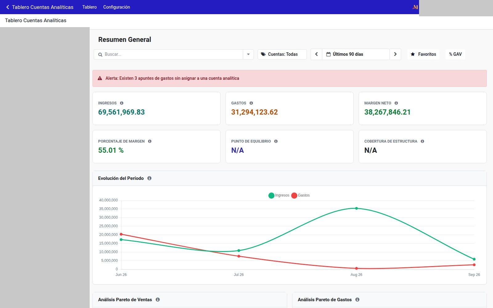
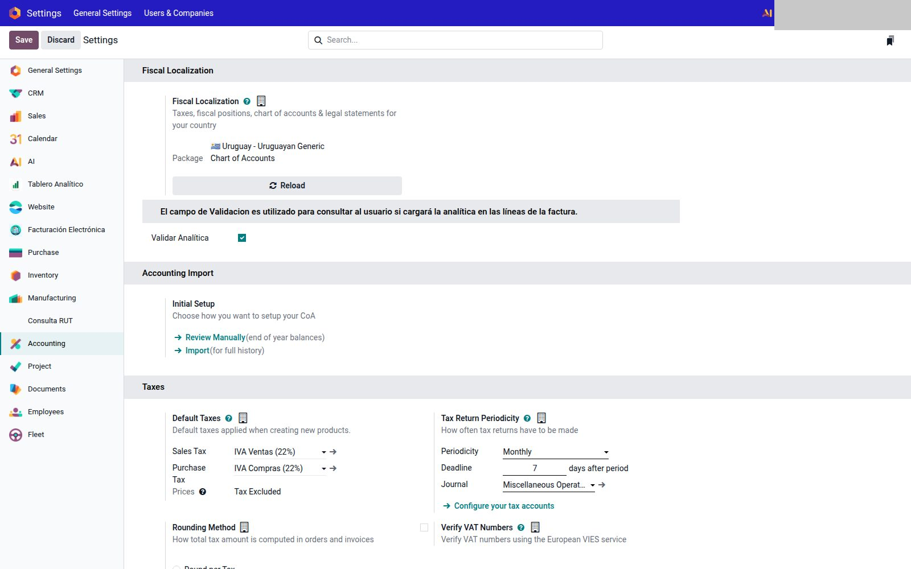
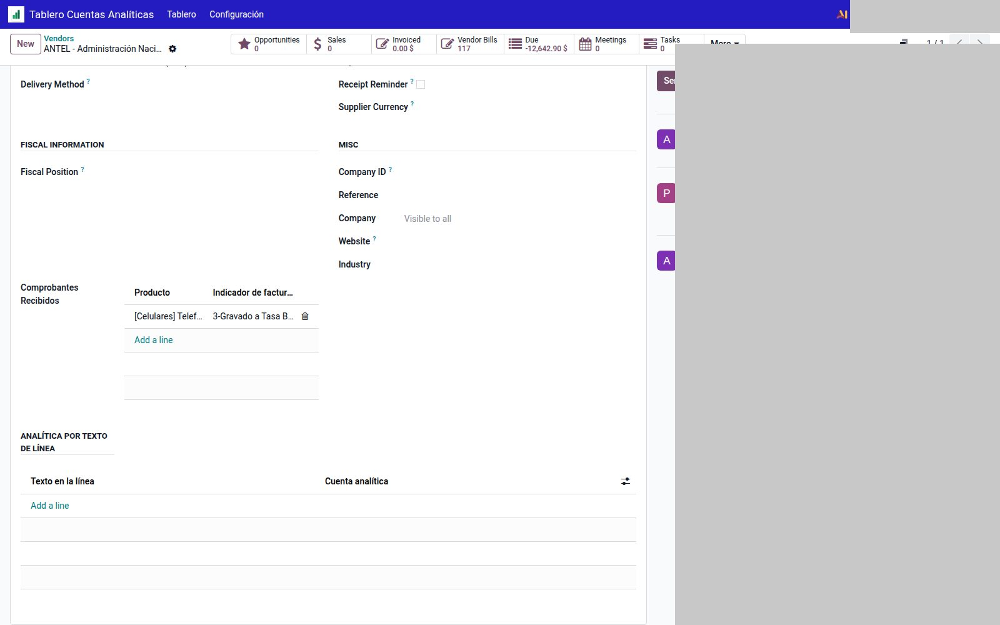

# Analítica

Tres módulos. Contabilidad analítica de Odoo tiene que estar activa (`Ajustes → Contabilidad`).

---

## Tablero

Módulo `analytic_dashboard`. App propia: **Tablero Cuentas Analíticas**.

1. `Tablero Cuentas Analíticas → Configuración`.
2. **Punto de equilibrio:** cuenta analítica de gastos (GAV) de **esta** compañía.
3. Filtros: solo movimientos comerciales; opcional incluir asientos de diario.
4. `Tablero Cuentas Analíticas → Tablero`. Filtros nativos (este mes / este año).

Los nombres de cuentas analíticas de un cliente no se publican.

---

## Aviso al confirmar sin analítica

Módulo `validate_distribution_analytic`.

En Ajustes, **por compañía**:

| Dónde | Campo |
|-------|--------|
| `Ajustes → Contabilidad` | **Validar Analítica** (facturas) |
| `Ajustes → Ventas` | **Validar Analítica SO** |
| `Ajustes → Compras` | **Validar Analítica PO** |

Si el flag está activo y confirmás un documento con líneas sin distribución analítica, sale el aviso:

- **Sí, continuar** — confirma igual.
- **Cancelar** — volvés a cargar la analítica.

En el producto podés marcar **Usa cuenta analítica como predeterminado** (venta y/o compra) y la distribución default.

El módulo **no** obliga: pregunta. El aviso ofrece **Sí, continuar** o **Cancelar**.

---

## Analítica por texto de línea

Módulo `partner_line_analytic_match`. En el **proveedor**, pestaña *Ventas y Compras*:

1. Grupo **Analítica por texto de línea**.
2. Una fila por regla: **Texto en la línea** (p. ej. un número de servicio) + **Cuenta analítica**.
3. Al cargar o cambiar la descripción de la línea en la factura de proveedor, Odoo asigna esa cuenta si el texto coincide.
4. Si cambiás el producto, se conserva la descripción de la línea de compra.

Sirve para facturas que siempre traen el mismo texto (telecom, banco, etc.) y van siempre a la misma analítica.

---

## Véase también

- [Color de barra por compañía](empresa.md)
- [Manual nativo de analítica](https://www.odoo.com/documentation/19.0/applications/finance/accounting/reporting/analytic_accounting.html)
