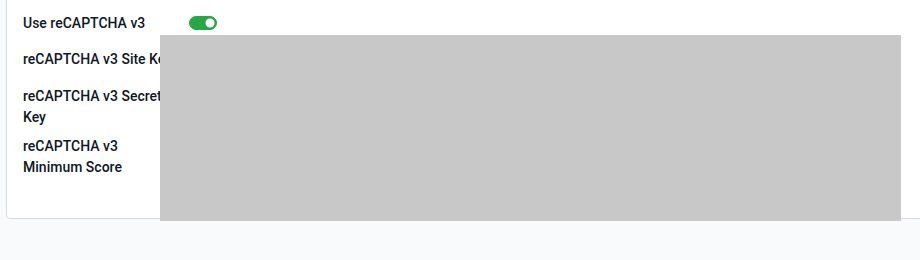

# Captcha de alta

Módulo `login_signup_captcha`. reCAPTCHA v3 (invisible) en **`/web/signup`**, por compañía. El login nativo **no** pide token.

1. Registrá el dominio en [Google reCAPTCHA v3](https://www.google.com/recaptcha/admin) y obtené site key + secret.
2. `Ajustes → Empresas` → la compañía → pestaña **Captcha Settings**.
3. Activá **Use reCAPTCHA v3**.
4. Pegá site key y secret. Score mínimo (default 0.5).
5. Guardá. Probá `/web/signup`. Score bajo o sin token: *Captcha verification failed*.

Site key y secret **no se publican**. Toggle on sin las dos claves: el alta falla.

No afecta el backend `/odoo` si el usuario ya está autenticado.
