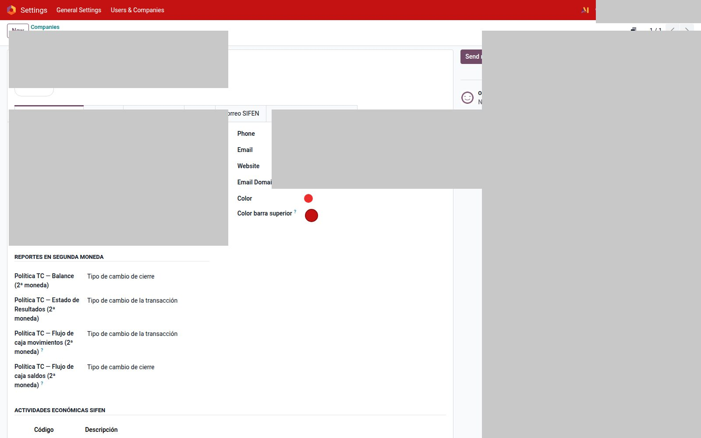

# Color de barra por compañía

Módulo `web_company_navbar_color`. En multi-empresa, cada compañía puede tener **otro color** en la barra superior para no cargar asientos en la empresa equivocada.

1. `Ajustes → Empresas` → abrí la compañía.
2. Campo **Color de barra** (`navbar_color`), al lado del color nativo de Odoo.
3. Guardá. Recargá: la barra toma ese color **solo** si hay una compañía activa (no un multi-selección).

Uruguay en estas capturas usa barra índigo; Paraguay, roja. Eso es este módulo, no un tema distinto.

No publica el nombre ni el RUT/RUC de la compañía.
