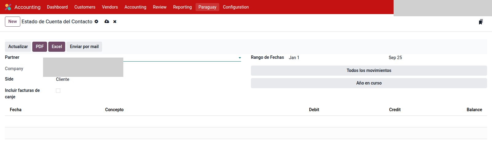

# Estado de cuenta del contacto

Módulo `account_partner_statement`. Cuenta corriente del contacto en la
**moneda de cada comprobante** (no convierte todo a la moneda de la compañía).

---

## Dónde

- `Contabilidad → Informes → Partner Reports → Estado de Cuenta del Contacto`
- En el contacto: botón **Estado de cuenta**

1. Contacto (siempre el comercial). **Cliente** o **Proveedor**.
2. Compañía (si hay varias). Rango de fechas, o **Año en curso** / **Todos los movimientos**.
3. Opcional: **Incluir facturas de canje** (el otro lado).
4. **Actualizar.** **PDF**, **Excel** o **Enviar por mail**.

Una columna **Concepto** (el nombre abre la factura o el pago). Saldos por
moneda, con total al pie de cada bloque.

El mail usa la plantilla del módulo. Se tapó compañía y datos del contacto.
