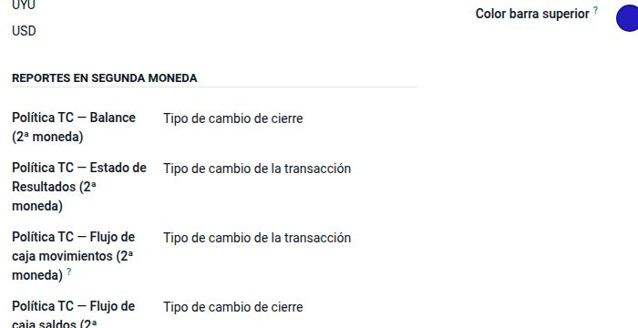
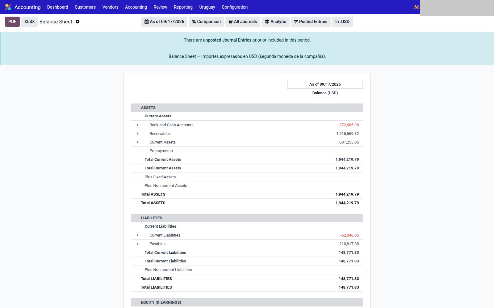

# Segunda moneda

Módulos `account_secondary_currency`, `account_reports_second_currency` y `account_reports_second_currency_ledgers` (`localization-multi`).

No es el TC DNIT ni la diferencia de cambio UY/PY. Es **otra moneda de presentación** (informes y precios). La factura **no** gana campos extra: la moneda del comprobante sigue siendo la nativa de Odoo.

---

## Compañía y producto

1. `Ajustes → Empresas` → **Secondary Currency** (junto a la moneda funcional) y las políticas de TC (cierre / transacción) para Balance, P&L y cash flow.
2. En el producto: costo y precio en esa moneda (TC del día).

---

## Reportes

Dos vías (conviven):

| Vía | Módulo | Qué ves |
|-----|--------|---------|
| 1 | `account_reports_second_currency` | Menús hermanos: **Balance Sheet (USD)**, **Profit and Loss (USD)**, **Cash Flow Statement (USD)** (el ISO es el de la compañía) |
| 2 | `account_reports_second_currency_ledgers` | Columnas extra en mayor, trial balance y antigüedad (Debe/Haber/Saldo en la 2.ª moneda) |

Si no hay 2.ª moneda, los menús de la vía 1 quedan sin sufijo ISO.

La diferencia de cambio **fiscal** sigue en [Uruguay](../uruguay/diferencia-cambio.md) o [Paraguay](../paraguay/tipo-cambio.md). No las mezcles con este reporte.
