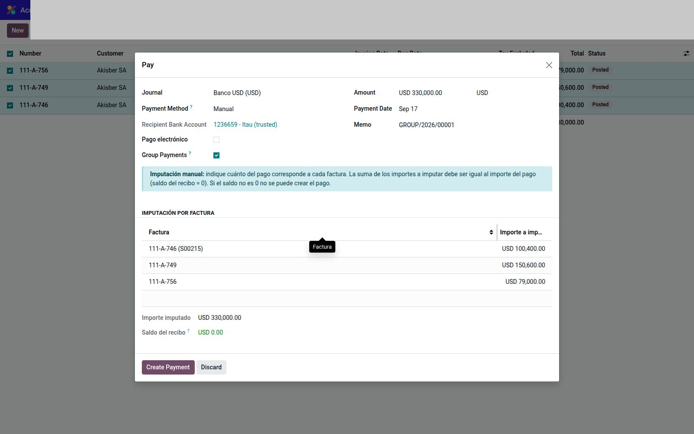
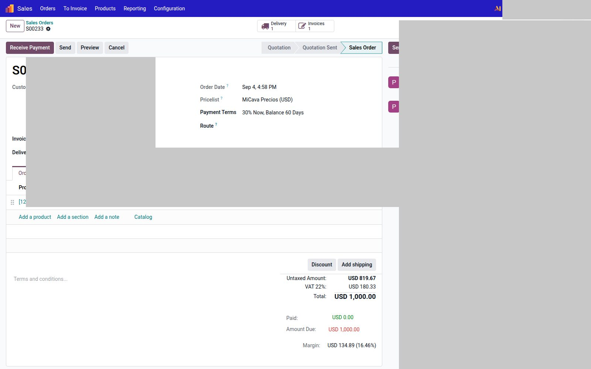

# Pagos: imputación y anticipos

Dos módulos distintos.

| Módulo | Dónde | Qué hace |
|--------|--------|----------|
| `account_payment_register_allocation` | Wizard **Registrar pago** | Partir el pago entre varias facturas a mano |
| `sale_payment_advance` | Pedido de venta | Cobrar una seña y conciliarla |

---

## Imputación manual

Cuando registrás un pago **agrupado** de **2 o más** facturas:

1. Seleccioná las facturas → **Registrar pago** → marcar **Agrupar pagos**.
2. Aparece **Imputación por factura**: importe a imputar por línea.
3. **Importe imputado** debe igualar el pago. **Saldo del recibo = 0** o no confirma.

Si no agrupás, o hay una sola factura, el bloque no se muestra (flujo nativo).

---

## Anticipo desde el pedido

En un pedido **confirmado** con saldo:

1. Botón **Receive Payment** (seña).
2. Importe, diario, fecha. Confirmar.
3. El pedido muestra **Paid** / **Amount Due** y la pestaña **Entregas de dinero**.
4. Al facturar, esa seña se concilia.

Varios anticipos parciales sobre el mismo pedido están permitidos.
