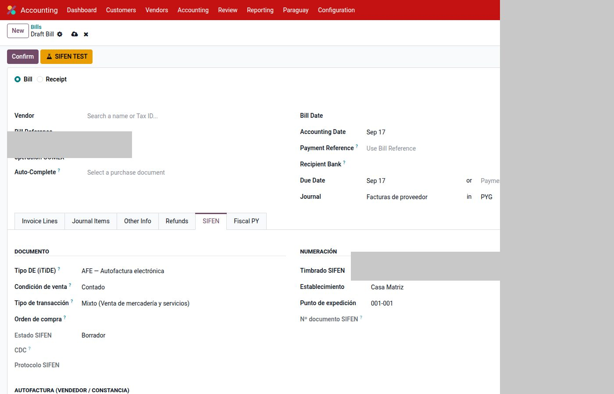
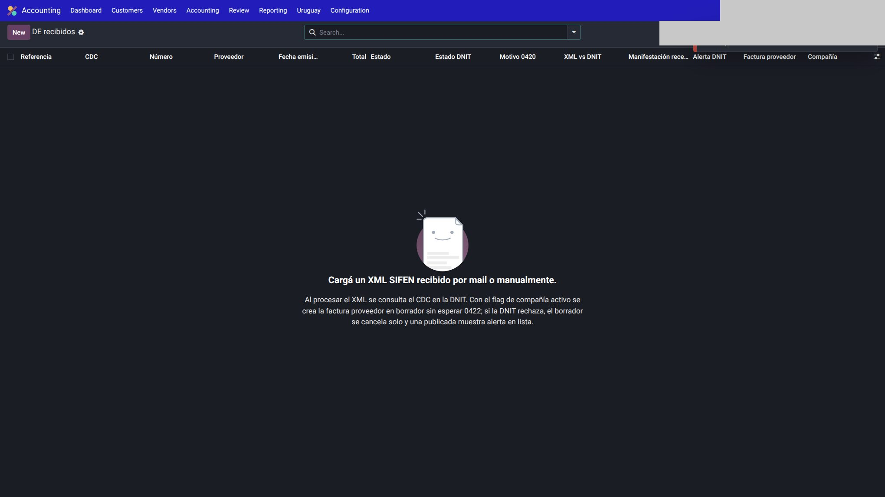
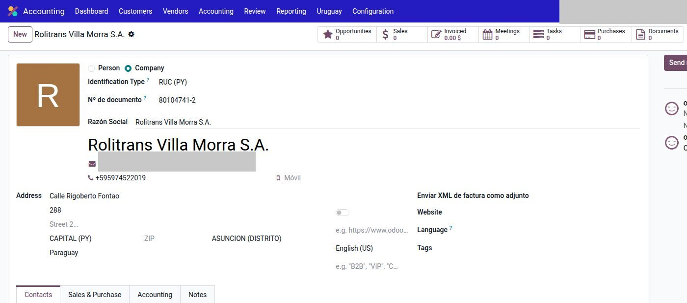
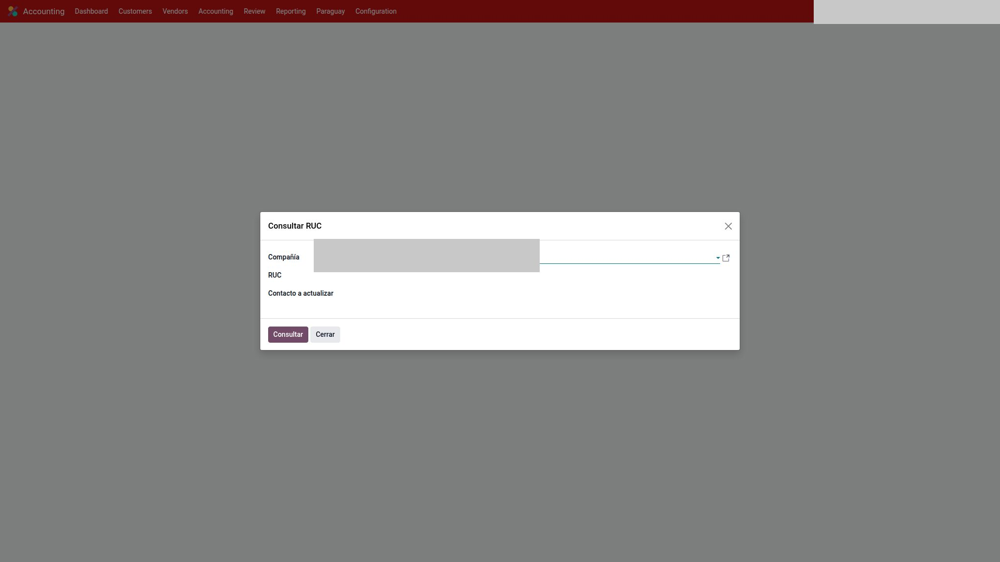

# Compras — Paraguay

Dos caminos distintos. No los mezcles.

| Origen | Qué hace Odoo | ¿Va a SIFEN? |
|--------|---------------|--------------|
| **Papel / RG90** | Registro contable con timbrado y número del proveedor | No |
| **XML de DE recibido** | Crea factura proveedor en borrador | Consulta/auditoría CDC; no “re-emite” |

---

## Factura de proveedor en papel

`Contabilidad → Proveedores → Facturas` → pestaña **SIFEN**, grupo **Comprobante recibido en papel**.

La numeración es **del proveedor**. No consume correlativos de la compañía.

Completá:

1. Tipo de comprobante recibido.
2. Timbrado del proveedor.
3. Establecimiento (3 dígitos).
4. Punto de expedición (3 dígitos).
5. Número (7 dígitos).

Son los únicos campos SIFEN que se editan a mano en una compra papel. Impuestos y cuentas: como cualquier factura Odoo, con IVA 10/5/exento del plan PY.

Tipos DNIT activos de la compañía alimentan el combo (RG90).

---

## DE recibidos (XML)

`Contabilidad → Proveedores → DE recibidos`.

1. Subí el XML (o llega por buzón IMAP **por compañía**: Odoo asigna por RUC receptor = RUC SIFEN de la empresa).
2. Procesar: arma la factura proveedor en **borrador**.
3. Completá cuentas, analítica e impuestos si hace falta.
4. Confirmá.

En la compañía (SIFEN → DE recibidos) puede estar el default **Crear factura al recibir XML**. Un rechazo DNIT posterior cancela el borrador o alerta si ya estaba publicado.

Carga manual de XML sigue disponible aunque el IMAP esté apagado.

!!! warning
    No pises productos ni montos de un XML ya parseado “para que cierre”. Si el XML es la fuente, se respeta.

---

## Consulta RUC

En el contacto (compañía fiscal PY):

1. Tipo de ID **RUC** y número `NNNNNNN-D`.
2. Acción **Consulta RUC** (también hay wizard en `Contabilidad → Paraguay`).

**TuRUC** completa nombre, DV, estado, tipo (domicilio solo en algunos casos, p. ej. entidades públicas). El flag de facturador electrónico puede llegar después (consulta SIFEN en cola).

También hay consulta por nombre si no sabés el RUC.

El **padrón RUC** es cache nacional (compartido entre compañías a propósito). CSV mínimo: `ruc`, `name`. El padrón público DNIT no trae domicilio.

---

## Comprobante de retención IVA {#comprobante-de-retencion-iva}

Si **esa** compañía tiene activado *Usar retención IVA Variante A* (`Contabilidad → Configuración → Ajustes`):

1. Pagá la factura de proveedor (el banco sale por el neto). El pago queda en **En proceso** o **Pagado**.
2. En el pago: **Emitir retención**.
3. Confirmá las facturas (podés destildar las que no correspondan) y el %.
4. Se crea el comprobante `CRET/…`, el asiento de pasivo DNIT y se cierra el residual de cada factura.

Listado: `Contabilidad → Paraguay → Comprobantes de Retención`. **Anular** solo si está emitido (revierte el asiento; no vuelve a borrador).

No hay un segundo botón ni un ítem en Reportes DNIT. Tampoco XML SIFEN (CRE iTiDE 8 sigue bloqueado por DNIT).

El botón aparece con el pago **En proceso** (asiento posteado, outstanding abierto) o **Pagado**. No espera la conciliación bancaria.

---

## Receptor de prueba (para poder emitir)

Aunque esta página es de compras, el cliente de una **venta** también es receptor SIFEN. Checklist:

- Tipo RUC y `vat` válido
- Calle + **número de puerta** (`dNumCasRec`)
- Distrito / ciudad DNIT

Sin número de puerta, DNIT rechaza **1330**.

---

## Véase también

- [Uso (ventas / KuDE)](uso.md)
- [Configuración](configuracion.md)
