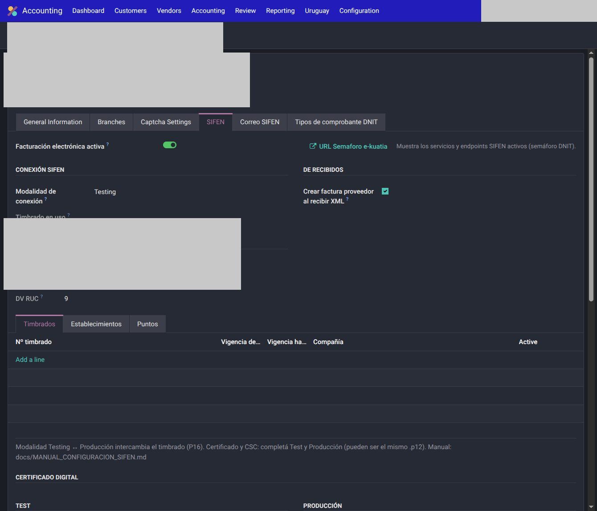
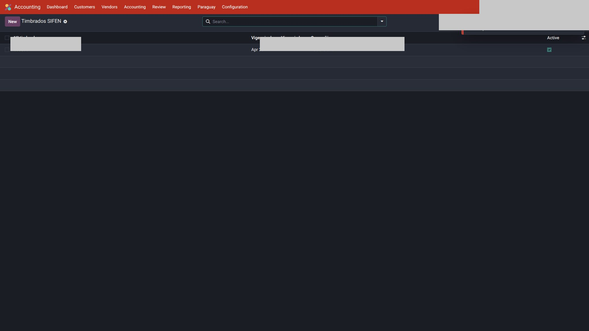
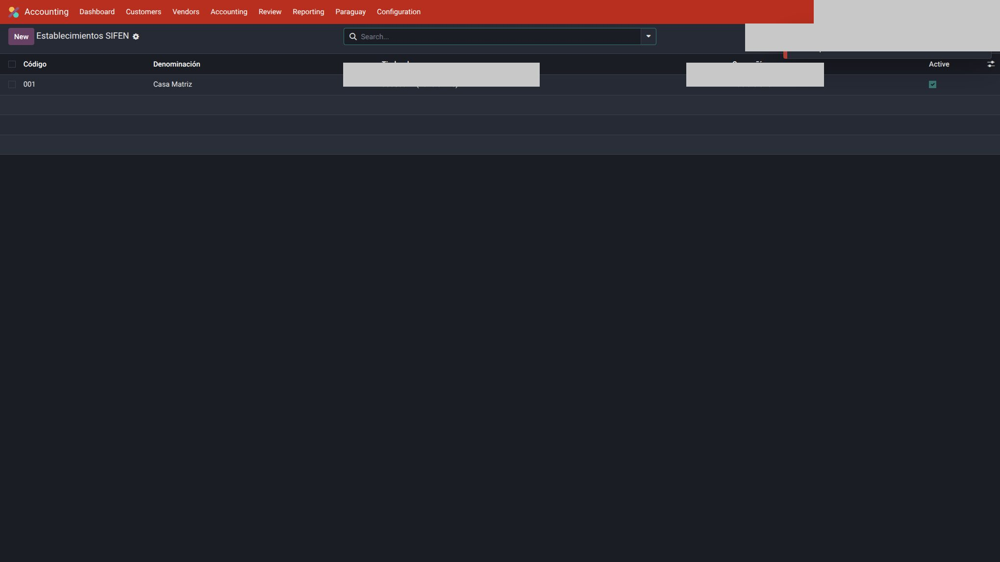
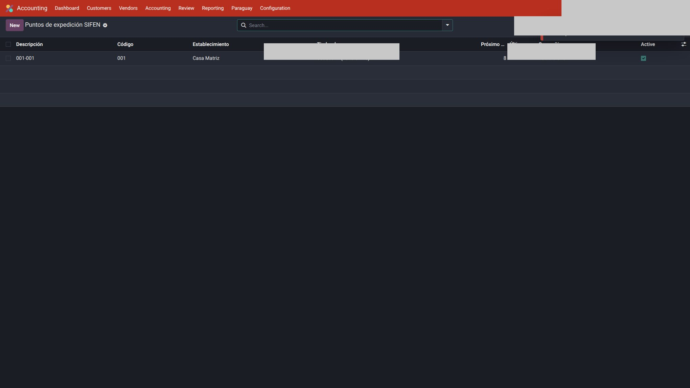
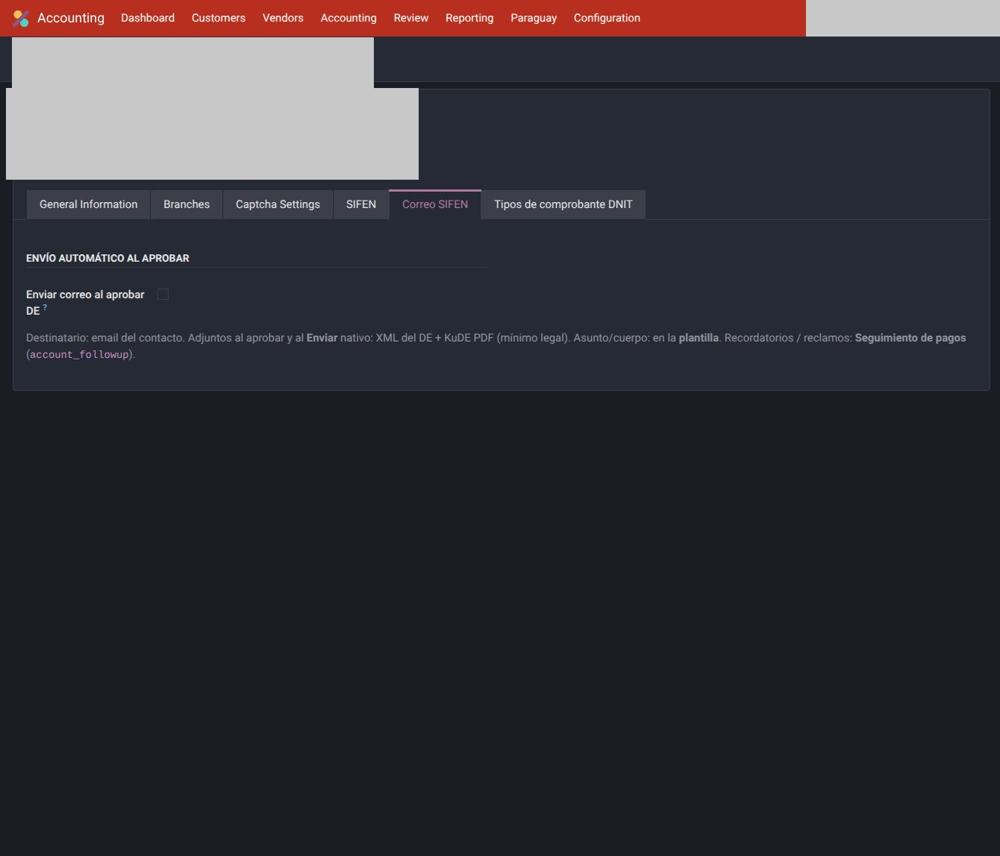

# Configuración — Paraguay

Primera vez **por compañía**. Cada empresa fiscal PY tiene su cert, CSC, timbrado y correlativos. No reutilices secretos de otra.

Orden recomendado:

1. País fiscal, moneda, RUC
2. Plan de cuentas y diarios ([detalle](cuentas.md))
3. SIFEN (si emite electrónico)
4. Timbrado, establecimiento, punto, actividades
5. Correo al aprobar DE
6. Un DE de prueba en **Testing**

---

## 1. Compañía

`Ajustes → Empresas` → abrir o crear la compañía.

1. **País fiscal:** Paraguay. La pestaña SIFEN y los menús Paraguay **solo** aparecen con país fiscal PY.
2. **Moneda** (habitualmente PYG).
3. **RUC** en `vat` con formato `cuerpo-DV`. Los campos RUC/DV SIFEN son **solo lectura**: salen de ese `vat`.
4. Dirección del emisor (calle, número de casa, geo DNIT).

!!! warning
    Sin país fiscal Paraguay no configures SIFEN “a ciegas” en una compañía Uruguay: la UI está gated a propósito.

---

## 2. Pestaña SIFEN

Misma ficha de compañía → pestaña **SIFEN**. Equivalente de menú: `Contabilidad → Paraguay → Facturación electrónica`.

| Campo | Qué hace |
|-------|----------|
| **Facturación electrónica activa** | Prende el conector (`sifen`). Apagado = no envía ni consulta DNIT (útil si esa empresa solo registra papel RG90). |
| **Modalidad de conexión** | **Testing** o **Producción**. Al cambiar, Odoo **intercambia el timbrado** (test = RUC del emisor en 8 dígitos; prod = timbrado Marangatu). |
| **URL semáforo e-kuatia** | Abre el semáforo DNIT (qué servicios SIFEN están operativos). |
| **Certificado digital** | Slot **Test** y slot **Producción**: archivo `.p12` + clave. Puede ser el mismo archivo en ambos; las claves no se publican. |
| **CSC (QR)** | Id CSC + CSC. **Test y Producción son distintos.** |

Al prender FE, Odoo exige cert + clave + Id CSC + CSC del **ambiente activo**. Si el slot está vacío, falla al emitir (no hay fallback viejo).

### CSC de Testing (público DNIT)

En ambiente de pruebas DNIT publica un CSC genérico (guía e-kuatia). Valores típicos:

| Id CSC | CSC |
|--------|-----|
| `0001` | `ABCD0000000000000000000000000000` |

**No** pongas el CSC de Marangatu (producción) en el slot Test: DNIT rechaza el QR (**2501**) aunque el XML esté bien.

El CSC de producción lo asigna Marangatu al RUC: **no va a este manual**.

---

## 3. Actividades económicas

En **Información general** de la compañía (bloque visible solo PY), abajo: **1 a 9** códigos Marangatu, **sin** prefijo `C4_`.

Sin al menos una actividad, Odoo corta **antes de firmar** (no es un rechazo DNIT). Usá los códigos reales de esa empresa; no copies los de otra.

---

## 4. Timbrado, establecimiento y punto

Notebook bajo SIFEN, o `Contabilidad → Paraguay → Facturación electrónica`.

1. **Timbrado**
    - Testing: número = RUC del emisor en 8 dígitos (`zfill`), con vigencia de la habilitación de prueba.
    - Producción: timbrado electrónico Marangatu. Odoo lo guarda aparte y lo **reactiva** al volver a Producción.
2. **Establecimiento** (`dEst`, 3 dígitos): calle, **número de casa**, teléfono, email, departamento / distrito / ciudad DNIT. Botón **Tomar de la compañía** si el domicilio es el mismo.
3. **Punto de expedición** (`dPunExp`, 3 dígitos) ligado al establecimiento.

Geo del emisor: Many2one DNIT. Sin ciudad/departamento válidos la emisión corta en local.

El correlativo (`dNumDoc`, 7 dígitos) lo asigna **Odoo** al confirmar. No se tipea. Si hay un hueco, hay que **inutilizar** numeración.

Formato que ves en el nombre de la factura:

`FE 001-001-0000001` = tipo + establecimiento – punto – número.

---

## 5. Correo al aprobar el DE

Pestaña **Correo SIFEN** en la compañía:

1. Una `mail.template` sobre `account.move` (y otra de `stock.picking` solo si emiten e-remito).
2. Activar **Enviar correo al aprobar DE**.
3. Elegir plantilla (el modelo tiene que coincidir).
4. Marcar los tipos de DE (`iTiDE`) que disparan el mail.
5. SMTP saliente operativo.

Asunto y cuerpo se editan en la plantilla / campos de compañía, **no** en Python. Al aprobar (envío o consulta de lote), si el partner tiene email, se manda XML + KuDE.

Cobranza / recordatorios: seguimiento nativo de Odoo (`account_followup`), no un wizard paralelo.

---

## 6. Hosts DNIT

`Contabilidad → Configuración → Ajustes` → bloque SIFEN (hosts). Override por compañía solo si hace falta.

| Ambiente | Uso |
|----------|-----|
| Test | `sifen-test.set.gov.py` |
| Producción | `sifen.set.gov.py` — no usar en desarrollo |

---

## 7. Prueba en Testing

1. FE activa, modalidad **Testing**, cert + CSC de test, una actividad, timbrado/est/punto.
2. Partner de prueba: RUC, calle, **número de puerta**, geo DNIT (sin nº de casa → rechazo **1330**).
3. Factura cliente → completar tipo de DE / condición / presencia en borrador → **Confirmar**.
4. Envío asíncrono: estado **Enviado** → cron cada 15 min o botón **Consultar lote SIFEN**.
5. **Aprobado:** XML y KuDE en adjuntos. **Imprimir** = KuDE. **Enviar** = flujo nativo.

---

## Véase también

- [Cuentas e impuestos](cuentas.md)
- [Uso](uso.md)
- [Compras](compras.md)
