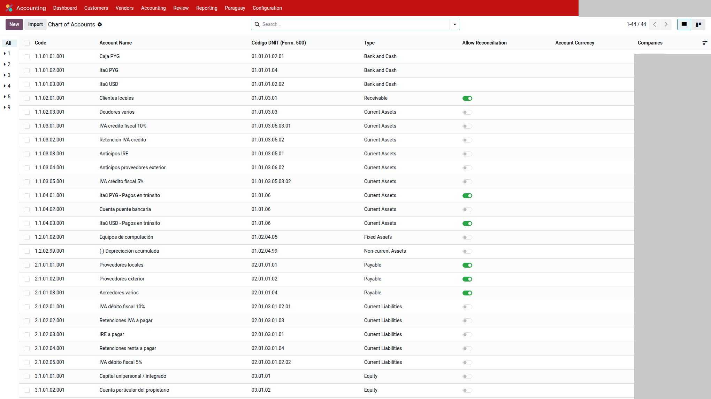
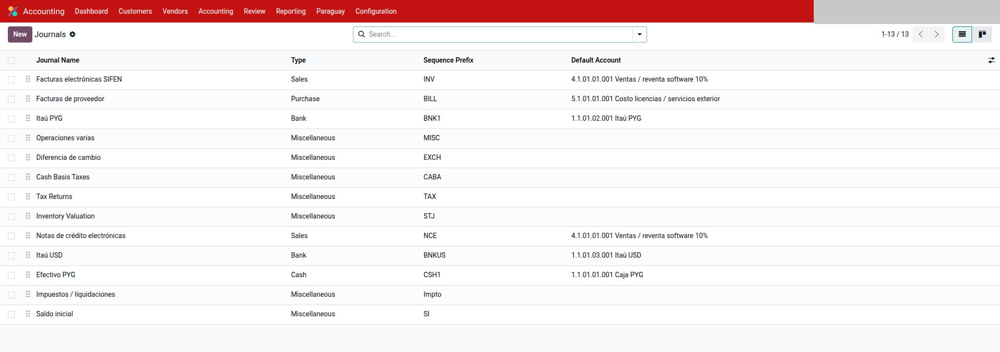
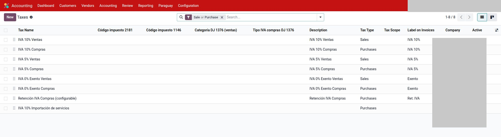
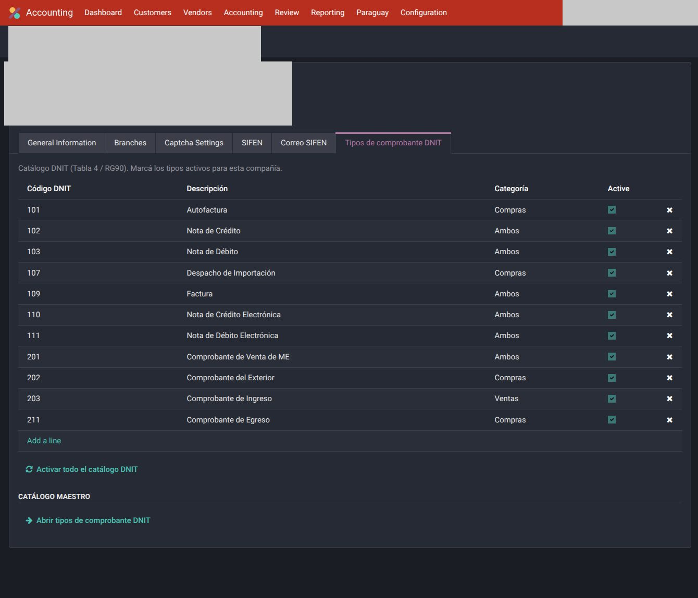

# Cuentas, diarios e impuestos — Paraguay

Instalá el chart **genérico** de la localización (`l10n_py`). No copies el plan de otra base ni de otra compañía de la misma base.

---

## Plan de cuentas

1. Compañía activa, país fiscal Paraguay.
2. Instalar `l10n_py` (chart `py_generico`).
3. `Contabilidad → Configuración → Plan de cuentas`.

    

4. Revisar clientes, proveedores, IVA, bancos, IRE / diferencia de cambio.

Códigos DNIT en cuentas (`l10n_py_dnit_code`) alimentan el EEFF RG 49/14 y el
Form. 500. Si están vacíos, esos reportes no calculan.

RG90 / Form 120 / Form 500 / EEFF / Libro IVA son documentos por compañía: no mezclan saldos entre empresas.

---

## Diarios

`Contabilidad → Configuración → Diarios`.

| Tipo | Rol PY |
|------|--------|
| Ventas | Emite DE si FE está activa. Timbrado / est / punto salen de la compañía; el diario no “es” el timbrado. |
| Compras | Factura papel (RG90) o borrador creado desde DE recibido. |
| Banco / caja | Pagos nativos. |
| Varios | Ajustes, retención IVA (si usa Variante A), diferencia de cambio. |

No reutilices diarios de una empresa Uruguay ni de otra PY.

---

## Impuestos IVA

`Contabilidad → Configuración → Impuestos`.

Tasas del plan genérico:

- IVA 10 %
- IVA 5 %
- Exento

Cuentas de débito/crédito = las de **esta** compañía. En la línea de factura, el tax es el que viaja al DE y al Form 120.
En impuestos de compañía PY: pestaña **Form 120 (PY)** (tags de casilla). El plan genérico ya los trae.

---

El menú **Paraguay** agrupa reportes DNIT, masters SIFEN y DE recibidos:

## Tipos DNIT (papel / RG90)

Catálogo global + **cuáles están activos en esta compañía** (pestaña de tipos DNIT).

Sirven para el combo de comprobante en facturas **papel**. Con FE activa, la factura de **cliente** electrónica no usa ese combo: el tipo de DE vive en SIFEN.

Exportación (Form 120): posición fiscal **Exportación** en el contacto o la factura, no el país ni FEE. Ver [Formulario 120](reportes.md#formulario-120-iva).

---

## Retención IVA (Variante A)

Si esa empresa usa el circuito:

1. `Contabilidad → Configuración → Ajustes` → bloque *Paraguay — Retención IVA*.
2. Activar Variante A, % default, flags de crédito / IRE.
3. Mapear cuentas + diario (o sugerir desde códigos del plan).

Uso: [Comprobante de retención IVA](compras.md#comprobante-de-retencion-iva) (botón en el pago de proveedor).

---

## Tipo de cambio DNIT

Módulo `l10n_py_currency_rate`: ver [Tipo de cambio](tipo-cambio.md). No compartir TC “a mano” entre empresas.

---

## Véase también

- [Configuración SIFEN](configuracion.md)
- [Uso](uso.md)
- [Reportes DNIT](reportes.md)
- [Tipo de cambio](tipo-cambio.md)
