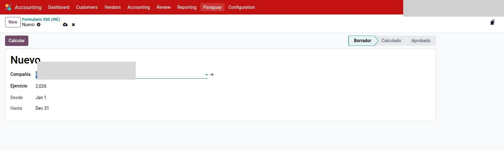
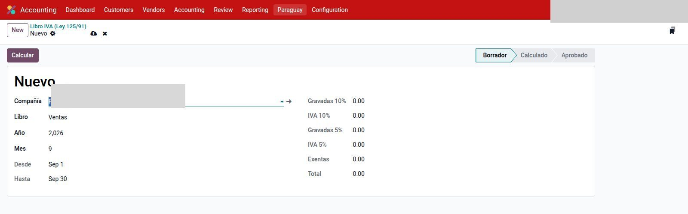

# Reportes DNIT

Módulo `l10n_py_tax_reports`. RG90, Form 120, Form 500, EEFF y Libro IVA son
**documentos persistentes** (lista + formulario, un registro por período).
Ya no son wizards. No mezclan saldos entre empresas.

`Contabilidad → Paraguay → Reportes DNIT`:

- RG90
- Formulario 120 (IVA)
- Formulario 500 (IRE)
- Estados Financieros (RG 49/14)
- Libro IVA (Ley 125/91)
- (la retención IVA ya no es un reporte: se emite desde el pago o se carga desde el cobro)

Estados comunes (salvo RG90): Borrador → Calculado → Aprobado.
**Calcular** solo en borrador. **Volver a Borrador** solo desde Calculado
(el RG90 también desde Aprobado / Exportado).

---

## RG90

`Contabilidad → Paraguay → Reportes DNIT → RG90`.

Un registro por compañía + obligación + período (no se duplica).

1. **Nuevo.** Obligación **Mensual (955)** o **Anual (956)**. En anual no hay mes.
2. **Compras / Egresos** y **Ventas / Ingresos** (ambos on por defecto).
3. **Calcular** (arma el snapshot) → **Aprobar**.
4. **Exportar ZIP** (solo en Aprobado). El archivo se genera en ese paso, no al calcular.
   El estado pasa a **Exportado**.

Los comprobantes **electrónicos SIFEN no entran** (tampoco el lote
pendiente de aprobación). Tipos DNIT activos: [Cuentas](cuentas.md).
Una NC/ND sin factura origen no calcula. Más de 5000 filas no arma un ZIP
anidado: hay que acotar el período o filtrar compras/ventas.

Si el mes solo tiene facturas electrónicas SIFEN, Calcular avisa que no hay
comprobantes (el ZIP de Marangatu es papel).

No se publica el archivo ni el RUC.

---

## Formulario 120 (IVA)

`Contabilidad → Paraguay → Reportes DNIT → Formulario 120 (IVA)`.

1. **Nuevo** del mes. Aperturas 46/51/215 solo la primera vez (si no hay 120 anterior).
2. **Calcular.** Arma bases e IVA 10 / 5 / exento. Las pestañas (Rubro 1–6 y anexo)
   aparecen después de calcular.
3. **Aprobar.** Queda en la lista (`F120/…`).
4. **Exportar XLSX** para tipear casillas en Marangatu. **Exportar PDF** es apoyo interno.

La DJ oficial se carga en Marangatu a mano. Si el tax de la factura está mal, el 120 miente.
Una línea con IVA 5 y 10 parte la base; no la duplica.
Las **notas de crédito** van a las casillas de devolución (15 / 34 / 37) con
importe **positivo**; el total (cas. 18 / 24 / 43) las resta. No restan en la
casilla de la factura original. Exportación y flete no tienen casilla de
devolución: la NC baja el mismo renglón.
Las facturas entran por **fecha de factura** (igual que el RG90); la cas. 52
(retención) por las cuentas Variante A, no por asientos misc.
Las facturas de **exportación** no se detectan por el país del cliente ni por FEE.
Hay que usar la posición fiscal **Exportación** (en el contacto o en la factura):
el IVA 10/5 de venta pasa a 0% exportación (cas. 14). Las compras a export usan
los impuestos «dest. exportación» / «indistintas» (se crean al instalar el módulo).
La cas. 64 es IVA a costo (exento); el IVA de exportación va al anexo (211/214),
no a esa casilla.

En el impuesto: pestaña **Form 120 (PY)** → tags de casilla. El plan genérico
ya los trae; si agregás un tax, asigná el tag.

---

## Estados financieros (RG 49/14)

`Contabilidad → Paraguay → Reportes DNIT → Estados Financieros (RG 49/14)`.

Papel de trabajo de Anexos 1–6 (Balance, Resultados y apoyo de flujo / PN / notas /
depreciación). **No** es la DJ Form. 500 (casillas web en Marangatu).
El PDF y el XLSX muestran las mismas hojas. Las notas se editan en el formulario
y salen al exportar (no hace falta recalcular).

Usa el código DNIT de cada cuenta (`l10n_py_dnit_code` en [Cuentas](cuentas.md)).
Si falta, el cálculo se corta. Las cuentas hijas se **suman al padre oficial**
(el planilla DNIT tiene menos filas que el plan NIC).

1. **Nuevo** del ejercicio (1/1–31/12). Tipo: Balance, Resultados o ambos.
2. **Calcular** → **Aprobar.** Queda en la lista (`EEFF/…`).
3. **Exportar EF** deja `{RUC}EF.xls` y `{RUC}EF.ods` para Marangatu
   y `{RUC}EF{año}.xlsx` de archivo. **Exportar PDF** deja también
   `{RUC}NE{año}.pdf` de las notas. Las hojas 3–6 son papel de trabajo.
   Con el EEFF aprobado las notas ya no se editan.

---

## Formulario 500 (IRE General)

`Contabilidad → Paraguay → Reportes DNIT → Formulario 500 (IRE)`.

Papel de casillas de la DJ de renta (obligación 700). **No** se sube a Marangatu:
se tipea. Reusa el EEFF del mismo ejercicio si ya está calculado.

En `Ajustes → Contabilidad`, bloque *Paraguay — Formulario 500 (IRE)*:
mínimo del promedio IRE para anticipos (cas. 126).

1. **Nuevo** del ejercicio → **Calcular**.
2. Volvé a Borrador para cargar casillas **manuales** (pérdidas, créditos, anticipos,
   y la cas. 31 si hay ingresos exentos de **IRE** — el exento de IVA no se resta solo).
   Casillas 129–133 son texto (RUC del contador, disposición legal), no importe.
3. **Calcular** de nuevo → **Aprobar** (usuario de contabilidad) → **Exportar XLSX**.
   El promedio de anticipos (cas. 267) usa solo los ejercicios que existen.

---

## Libro IVA (Ley 125/91)

`Contabilidad → Paraguay → Reportes DNIT → Libro IVA (Ley 125/91)`.

Libro mensual de ventas o compras (papel y electrónicos). NC/ND restan.
**Exportar XLSX** es apoyo interno. El archivo que se sube a Marangatu sigue
siendo el **RG90** (solo papel).

1. **Nuevo** → Ventas o Compras → mes.
2. **Calcular** → **Aprobar.** Queda en la lista (`L104/…`).

---

## Retención IVA

Ya no es un reporte ni un wizard bajo Reportes DNIT. Se emite desde el
pago de proveedor: [Compras — comprobante de retención](compras.md#comprobante-de-retencion-iva).

---

## Véase también

- [Tipo de cambio y diferencia](tipo-cambio.md)
- [Cuentas e impuestos](cuentas.md)
- [Compras](compras.md)
