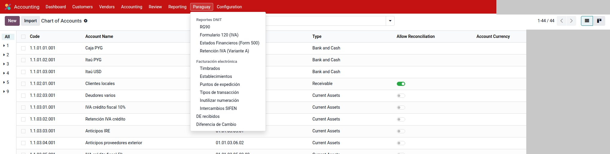
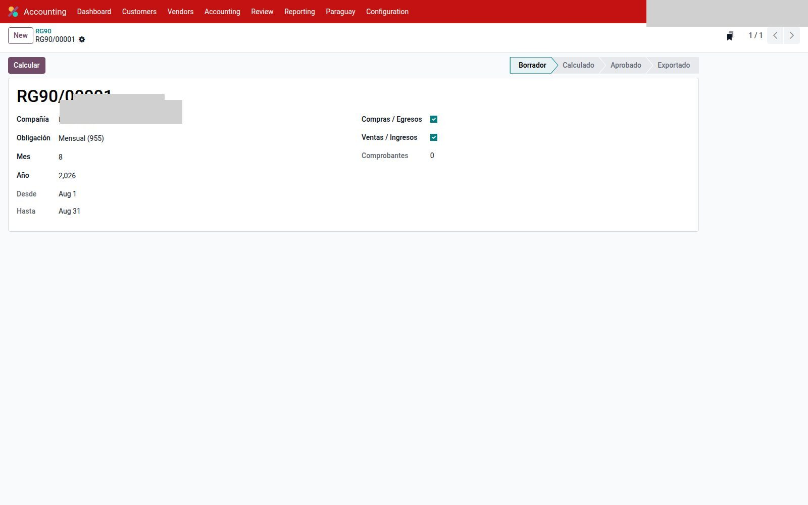
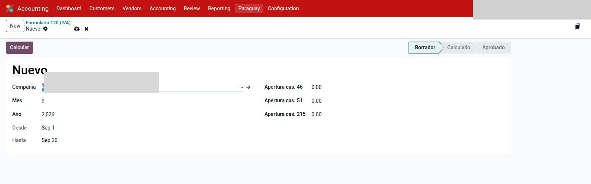
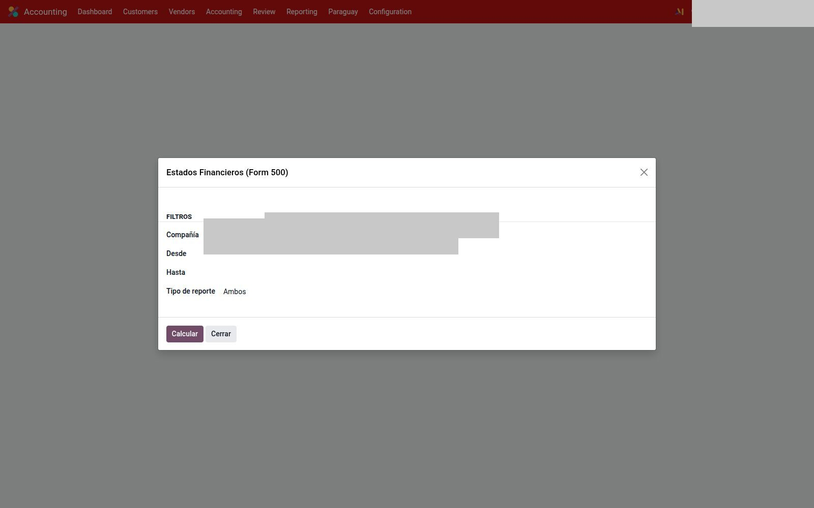
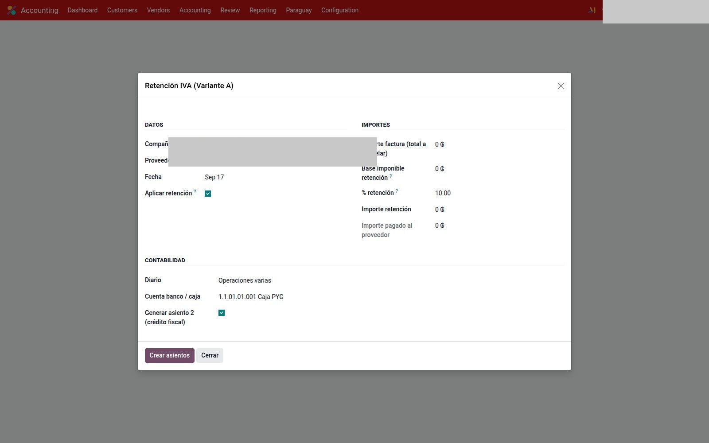

# Reportes DNIT

Módulo `l10n_py_tax_reports`. RG90, Form 120 y EEFF son **documentos persistentes**
(lista + estados, un registro por período). No mezclan saldos entre empresas.

`Contabilidad → Paraguay → Reportes DNIT` (RG90, Form 120, Form 500, EEFF,
Libro IVA) y **Retención IVA (Variante A)**.

---

## RG90

`Contabilidad → Paraguay → Reportes DNIT → RG90`.

1. **Nuevo.** Obligación **Mensual (955)** o **Anual (956)**.
2. **Calcular** → **Aprobar**.
3. **Exportar ZIP** para Marangatu. El ZIP queda en el registro (`RG90/…`).

Los comprobantes **electrónicos SIFEN no entran** (tampoco el lote
pendiente de aprobación). Tipos DNIT activos: [Cuentas](cuentas.md).
Una NC/ND sin factura origen no calcula. Más de 5000 filas no arma un ZIP
anidado: hay que acotar el período o filtrar compras/ventas.

No se publica el archivo ni el RUC.

---

## Formulario 120 (IVA)

`Contabilidad → Paraguay → Reportes DNIT → Formulario 120 (IVA)`.

1. **Nuevo** del mes. Aperturas 46/51/215 solo la primera vez.
2. **Calcular.** Arma bases e IVA 10 / 5 / exento de ventas y compras.
3. **Aprobar.** Queda en la lista (`F120/…`).
4. **Exportar XLSX** para tipear casillas en Marangatu. El PDF es apoyo interno.

La DJ oficial se carga en Marangatu a mano. Si el tax de la factura está mal, el 120 miente.
Una línea con IVA 5 y 10 parte la base; no la duplica.
Las facturas entran por **fecha de factura** (igual que el RG90); los asientos
de retención (cas. 52) por fecha contable.

---

## Estados financieros (RG 49/14)

`Contabilidad → Paraguay → Reportes DNIT → Estados Financieros (RG 49/14)`.

Papel de trabajo de Anexos 1–6 (Balance, Resultados y apoyo de flujo / PN / notas /
depreciación). **No** es la DJ Form. 500 (casillas web en Marangatu).
El PDF y el XLSX muestran las mismas hojas. Las notas se editan en el formulario
y salen al exportar (no hace falta recalcular).

Usa el código DNIT de cada cuenta (`l10n_py_dnit_code` en [Cuentas](cuentas.md)).
Si falta, el cálculo se corta. Las cuentas hijas se **suman al padre oficial**
(el planilla DNIT tiene menos filas que el plan NIC).

1. **Nuevo** del ejercicio (1/1–31/12). Tipo: Balance, Resultados o ambos.
2. **Calcular** → **Aprobar.** Queda en la lista (`EEFF/…`).
3. **Exportar EF** (un botón) deja `{RUC}EF.xls` y `{RUC}EF.ods` para Marangatu
   y `{RUC}EF{año}.xlsx` de archivo. **Exportar PDF** deja también
   `{RUC}NE{año}.pdf` de las notas. Las hojas 3–6 son papel de trabajo.
   Con el EEFF aprobado las notas ya no se editan.

---

## Formulario 500 (IRE General)

`Contabilidad → Paraguay → Reportes DNIT → Formulario 500 (IRE)`.

Papel de casillas de la DJ de renta (obligación 700). **No** se sube a Marangatu:
se tipea. Reusa el EEFF del mismo ejercicio si ya está calculado.

1. **Nuevo** del ejercicio → **Calcular**.
2. Volvé a Borrador para cargar casillas manuales (pérdidas, créditos, anticipos,
   y la cas. 31 si hay ingresos exentos de **IRE** — el exento de IVA no se resta solo).
3. **Calcular** de nuevo → **Aprobar** (usuario de contabilidad) → **Exportar XLSX**.
   El promedio de anticipos (cas. 267) usa solo los ejercicios que existen.
   RUC del contador y disposición legal van como texto, no como importe.

---

## Libro IVA (Ley 125/91)

`Contabilidad → Paraguay → Reportes DNIT → Libro IVA (Ley 125/91)`.

Libro mensual de ventas o compras (papel y electrónicos). NC/ND restan.
**Exportar XLSX** es apoyo interno. El archivo que se sube a Marangatu sigue
siendo el **RG90** (solo papel).

1. **Nuevo** → Ventas o Compras → mes.
2. **Calcular** → **Aprobar.** Queda en la lista (`L104/…`).

---

## Retención IVA (Variante A)

Solo si **esa** empresa usa el circuito. Primero: `Contabilidad → Configuración → Ajustes` → bloque *Paraguay — Retención IVA* (activar Variante A, %, flags de crédito / IRE, diario y cuentas).

Uso: `Contabilidad → Paraguay → Retención IVA (Variante A)`.

1. Compañía, proveedor, fecha.
2. Importe de factura. Si **Aplicar retención** está apagado, no genera asientos.
3. Base, %, diario y cuenta banco.
4. **Crear asientos.** Quedan el pago y, si corresponde, el crédito.

---

## Véase también

- [Tipo de cambio y diferencia](tipo-cambio.md)
- [Cuentas e impuestos](cuentas.md)
- [Compras](compras.md)
