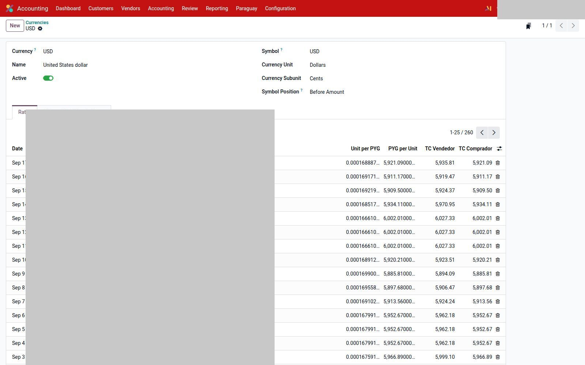
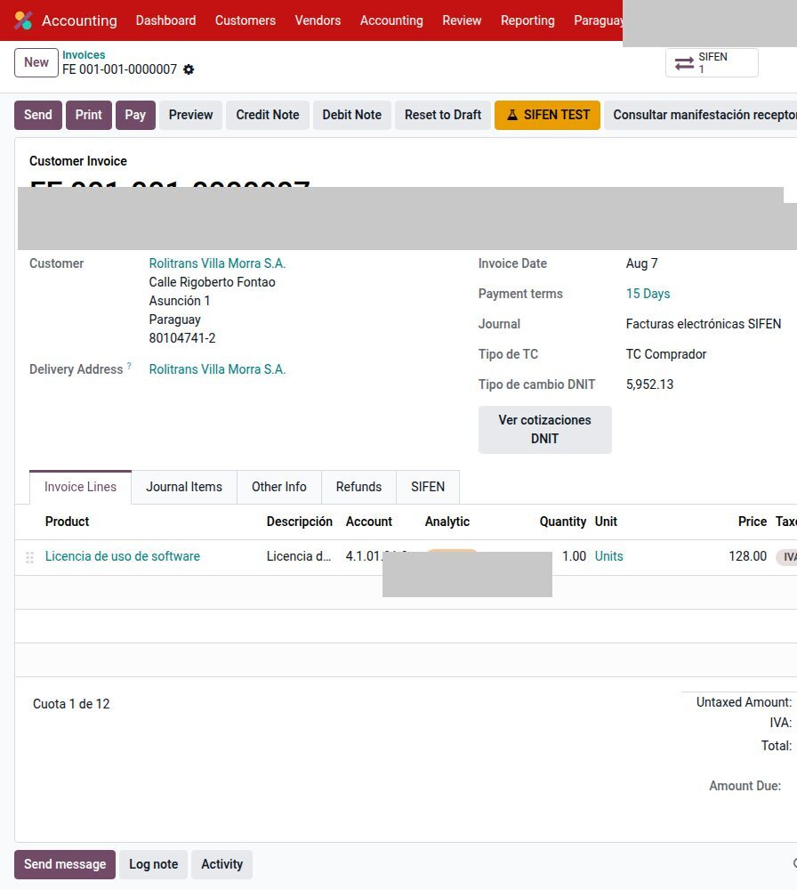
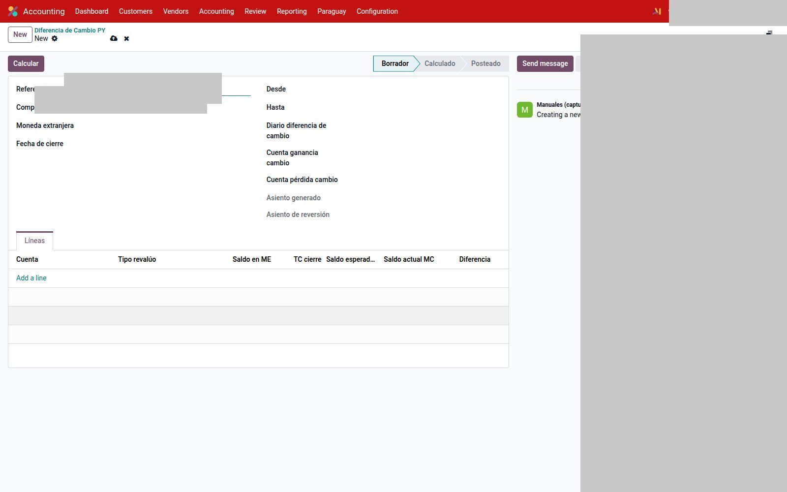

# Tipo de cambio y diferencia — Paraguay

Dos módulos distintos:

| Módulo | Qué hace |
|--------|----------|
| `l10n_py_currency_rate` | Cotización **comprador / vendedor** DNIT, por compañía |
| `l10n_py_exchange_difference` | Revalúo IRE al cierre (Decreto 3182/2019) |

No compartas el TC “a mano” entre empresas de la misma base.

---

## Cotizaciones DNIT

El cron **Paraguay: sync cotizaciones DNIT (YTD)** baja el histórico (cada hora). También se puede pedir a demanda.

En la moneda (p. ej. USD), con compañía fiscal Paraguay:

1. `Contabilidad → Configuración → Monedas` → abrí USD.
2. Pestaña **Obtener Histórico de Tasas**: desde / hasta → **Importar histórico**.
3. **Ver cotizaciones DNIT** abre el portal oficial.

En cada tasa aparecen **TC Vendedor** y **TC Comprador**.

### En la factura

Si la factura no está en PYG:

- **Tipo de TC:** comprador, vendedor o **manual**.
- El importe del TC se edita solo en modo manual y en borrador.
- Si DNIT no publicó esa fecha: aviso + enlace al portal.

Ventas usan vendedor; compras, comprador — salvo que elijas manual.

---

## Diferencia de cambio (IRE)

`Contabilidad → Paraguay → Diferencia de Cambio`.

1. **Nuevo.** Compañía, moneda (USD), fecha de cierre, rango, diario, cuentas de ganancia y pérdida.
2. **Calcular.** Líneas: cuenta, saldo ME, TC de cierre, esperado vs real, diferencia.
3. Revisá. **Postear** genera el asiento en la fecha de cierre y una **reversión automática al 1/1 del año siguiente**.
4. Activos revalúan con **TC comprador**; pasivos con **TC vendedor**.
5. **Revertir** cancela esa reversión si hay que regenerar el período.

Estados: Borrador → Calculado → Posteado. Sin TC DNIT en la fecha de cierre, el cálculo falla.

El diario y las cuentas son de **esta** compañía. No uses el diario de diferencia Uruguay.

---

## Véase también

- [Reportes DNIT](reportes.md)
- [Cuentas e impuestos](cuentas.md)
