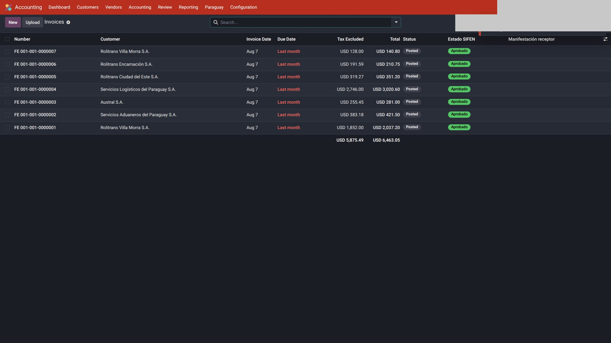
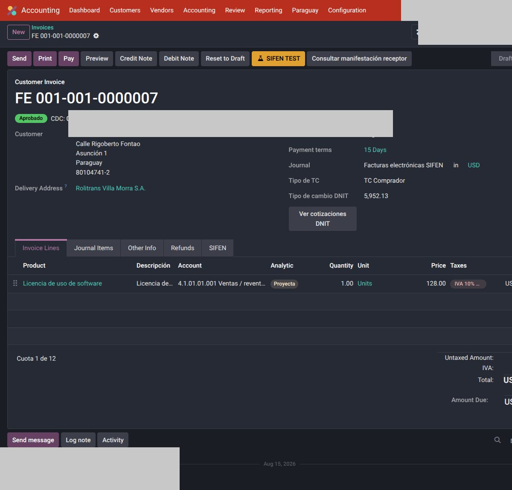
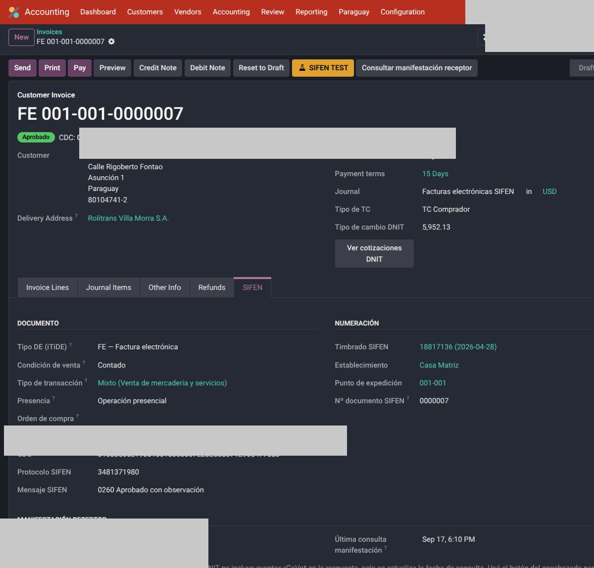
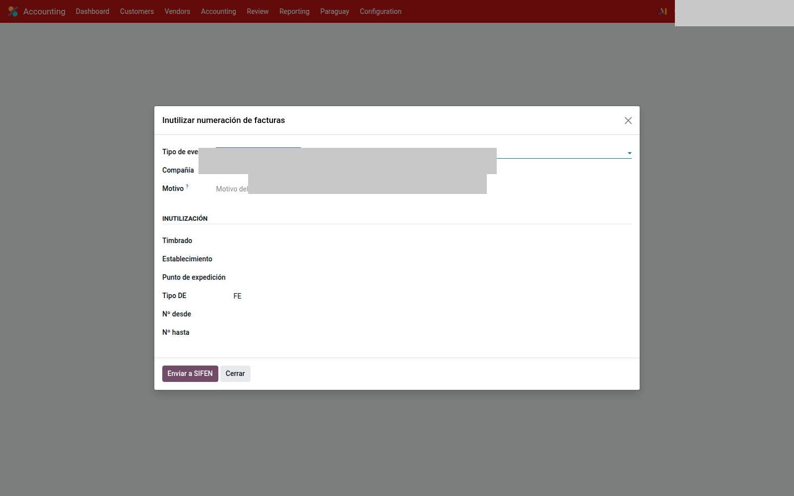
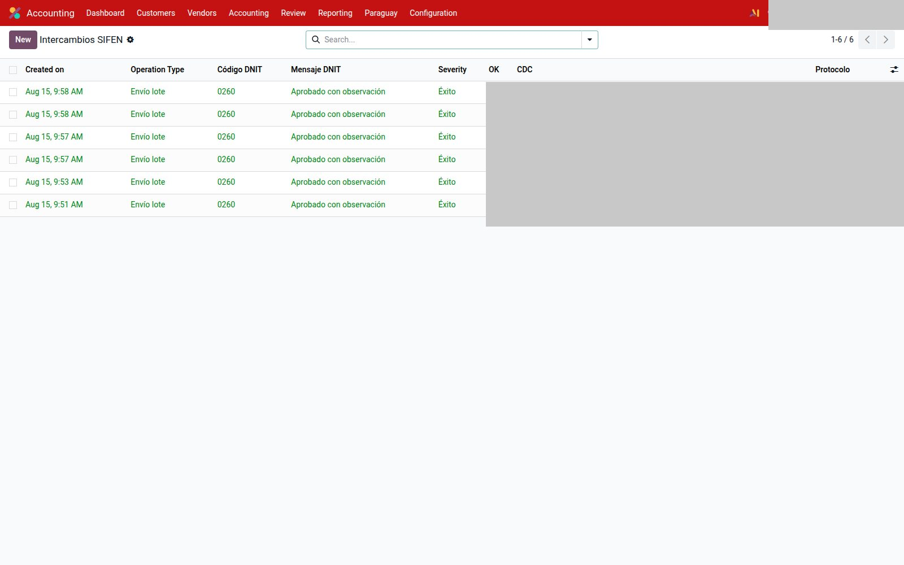

# Uso — Paraguay

Día a día con SIFEN en **Testing** (o Producción, solo si esa compañía ya hizo el cambio explícito).

!!! tip "Un solo camino"
    **Imprimir** y **Enviar** son los nativos. Con el DE **aprobado**, el PDF default es el **KuDE**. No hay botón paralelo “KuDE”.

---

## Factura de cliente (DE emitido)

1. `Contabilidad → Clientes → Facturas` → Crear.

    
2. Diario de ventas, partner con RUC, calle y **número de puerta**, geo DNIT.
3. Líneas e IVA (10 / 5 / exento).
4. En **borrador**, pestaña SIFEN: tipo de DE, condición de venta, presencia, cuotas si aplica, documento asociado si es NC/ND.
5. **Confirmar.** Odoo publica el número (`FE 001-001-…`) y envía el lote a SIFEN.
6. Los datos SIFEN del comprobante quedan de **solo lectura** (ya se transmitió).

    

    

Envío **asíncrono** por defecto: SIFEN devuelve ticket de lote; Odoo consulta el resultado.

| Estado SIFEN | Qué hacer |
|--------------|-----------|
| Enviado | Esperar cron (15 min) o **Consultar lote SIFEN**. |
| Aprobado | XML + KuDE en el clip / chatter. Imprimir / Enviar. |
| Rechazado | La factura **vuelve a borrador** (conserva el número). Corregí el motivo y **Confirmá de nuevo** (mismo Nº). No hay botón “Reenviar SIFEN”. |

En la lista: columna **Estado SIFEN**. El XML crudo está en el smart button SIFEN.

!!! note "Adenda"
    El texto de términos / `narration` va al **KuDE PDF**. No se manda como `dInfAdic` en el XML (DNIT lo rechaza).

---

## Nota de crédito / débito

Documento asociado al DE original (referencia SIFEN). Mismo circuito de lote. No armes una NC sin vínculo: DNIT la rechaza.

---

## Imprimir y enviar

1. **Imprimir:** KuDE (PDF con QR) si el DE está aprobado.
2. **Enviar:** asistente nativo. Adjuntos: KuDE + XML, según la plantilla de **Correo SIFEN**.
3. Mail automático: al pasar a Aprobado, si la compañía tiene el toggle y el tipo marcado.

Recordatorios de cobro: **Seguimiento de pagos** nativo, no un segundo wizard.

---

## Cancelar o inutilizar

`Contabilidad → Paraguay → Facturación electrónica`.

**Cancelar factura** es un **botón en el DE aprobado** (no hay menú Cancelar). Ventana DNIT: **48 h** desde la aprobación, con CDC. Motivo mínimo 5 caracteres → **Enviar a SIFEN**. Después de las 48 h: nota de crédito. No vuelve a borrador.

**Inutilizar numeración** (`Contabilidad → Paraguay → Facturación electrónica → Inutilizar numeración`): hueco de correlativo. Timbrado, establecimiento, punto, tipo de DE, número desde / hasta, motivo. No “tapés” el hueco con una factura ficticia.

---

## Intercambios SIFEN

`Contabilidad → Paraguay → Facturación electrónica → Intercambios SIFEN`.

Lista de request/response (lote, evento, consulta). Columnas: fecha, operación, código, mensaje, severidad, CDC, protocolo.

Si la factura quedó en **Enviado**:

1. **Consultar lote SIFEN** en el comprobante.
2. Si el lote no existe o hay timeout, abrí el intercambio de esa factura.
3. No cambies el CDC a mano.

---

## Véase también

- [Configuración](configuracion.md)
- [Compras (papel y XML)](compras.md)
- [Reportes DNIT](reportes.md)
- [Tipo de cambio](tipo-cambio.md)
