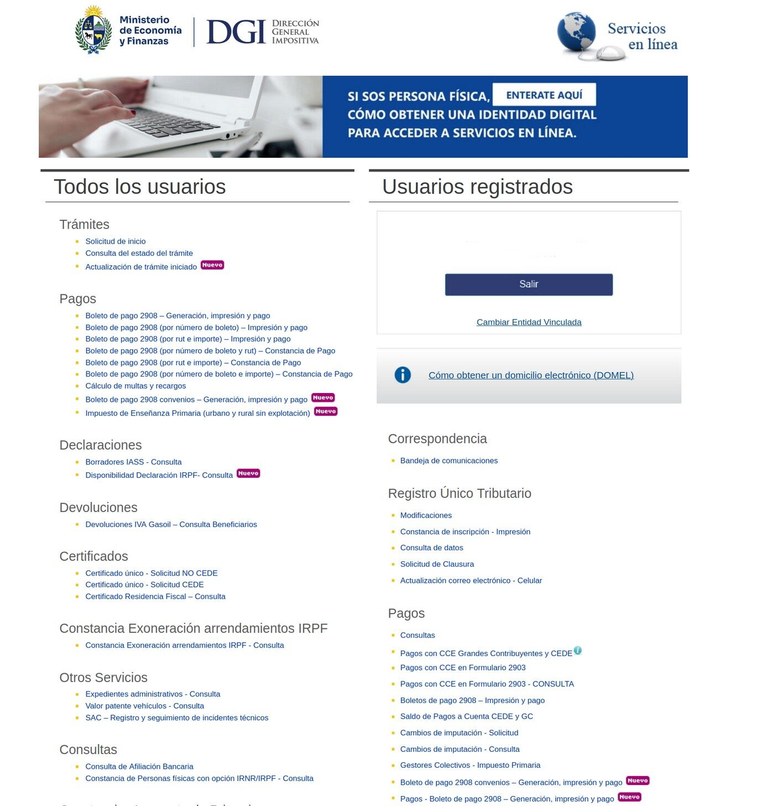
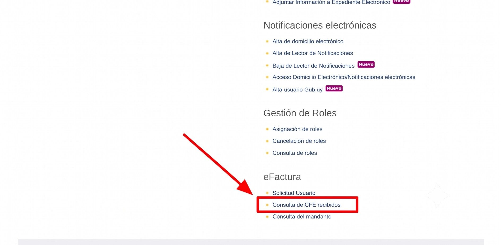
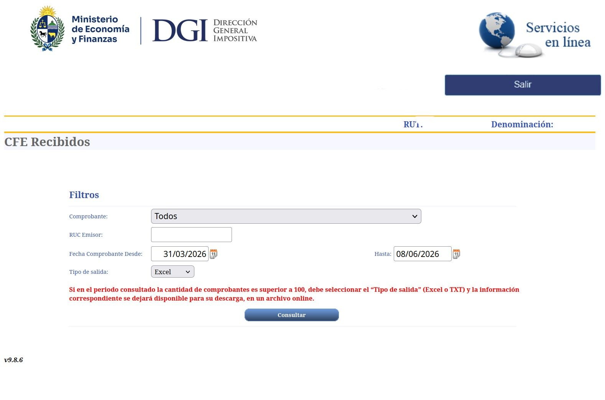
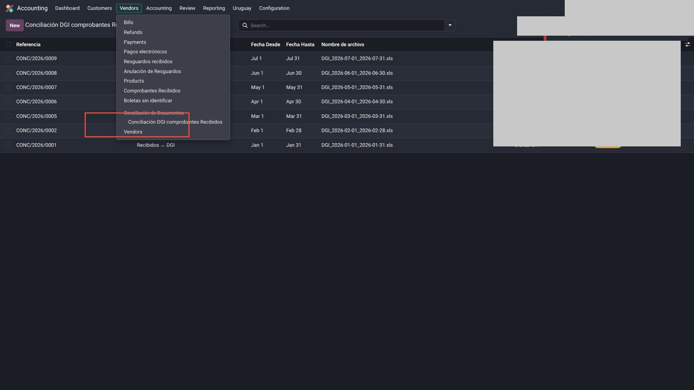
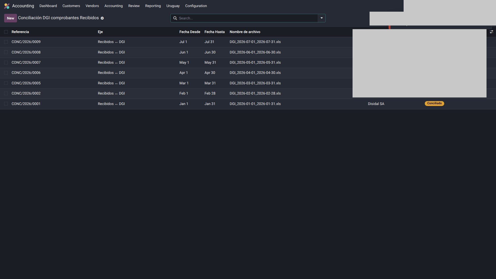
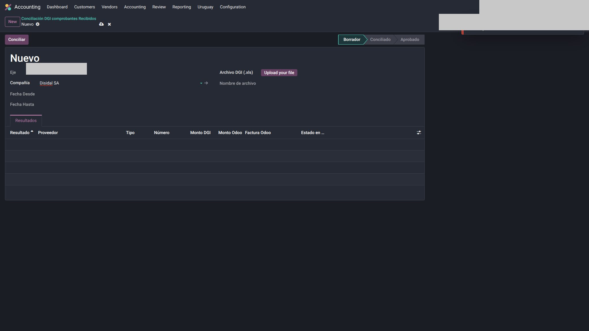
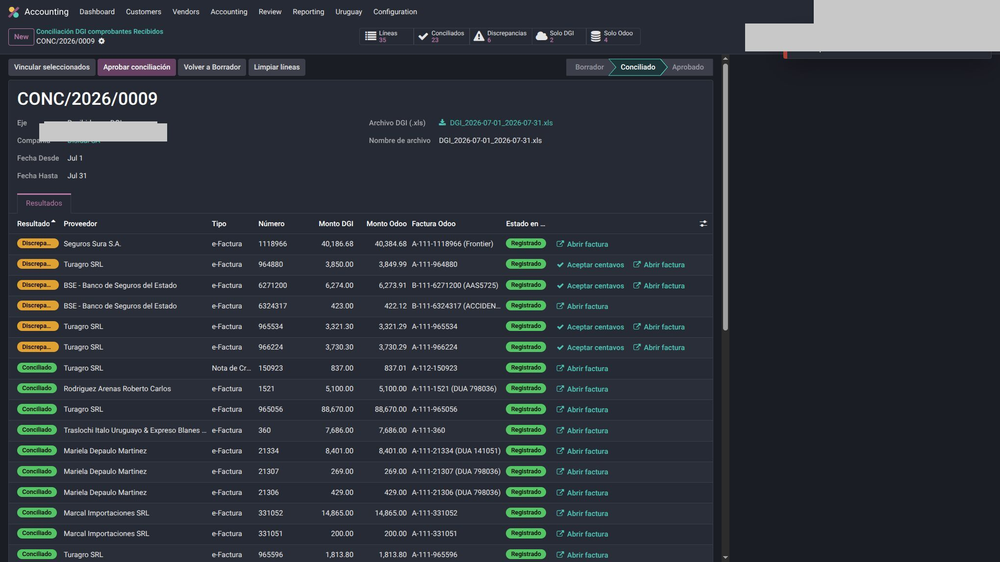
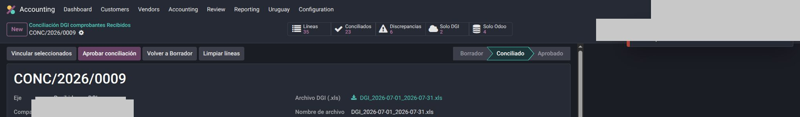
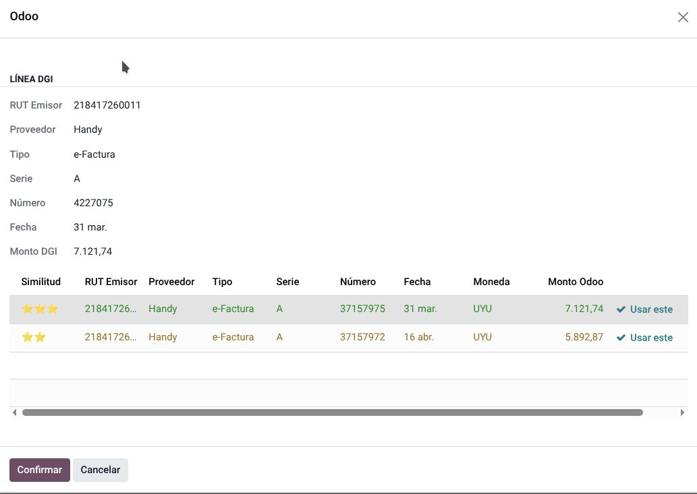
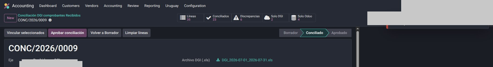

# Conciliación DGI — comprobantes recibidos

Cruzar los CFE **recibidos** que lista DGI contra las facturas de proveedor en Odoo.

| Resultado | Significado |
|-----------|-------------|
| **Conciliado** | Está en DGI y en Odoo, montos coinciden |
| **Discrepancia** | Está en ambos, el monto difiere |
| **Solo en DGI** | DGI lo lista; en Odoo no aparece (o el número no matchea) |
| **Solo en el sistema** | Está en Odoo; DGI no lo lista en ese período |

!!! warning "No crear facturas a ciegas"
    Un “Solo DGI” puede ser el mismo CFE con **otra serie/número**, **otra fecha** o una NC. Buscá bien (RUT, número cercano, draft y posted) antes de **Crear factura**.

!!! note
    Capturas de Odoo tomadas de una base real. Se tapó el nombre de la **compañía** y menús propios del cliente. Proveedores, RUT de emisor y montos se dejan: son el ejemplo de uso.

---

## 1. Bajar el archivo en DGI

Antes de conciliar en Odoo, exportá el listado del período.

1. Entrá a [servicios.dgi.gub.uy/serviciosenlinea](https://servicios.dgi.gub.uy/serviciosenlinea) (usuario registrado).

    

2. En **eFactura** → **Consulta de CFE recibidos** (al final de la página).

    

3. Rango de fechas del período. Tipo de salida **Excel**. **Consultar** y descargar.

    

El archivo se llama así (el RUT es el de **tu** empresa, no se publica acá):

`ExportCFERecibidos-Ruc[RUT]_Periodo-[YYYY_M_D]-[YYYY_M_D].xls`

Guardalo: es el que se sube en el paso siguiente.

Si el período tiene más de 100 comprobantes, DGI deja el Excel/TXT para descarga online (aviso en rojo en esa pantalla).

---

## 2. Dónde está en Odoo

`Contabilidad → Proveedores → Conciliación de Documentos → Conciliación DGI comprobantes Recibidos`

Ya **no** está bajo el menú Uruguay: en Odoo 19 el ítem cuelga de **Proveedores** (junto a Comprobantes Recibidos).

Si ya hay conciliaciones, la lista muestra referencia, fechas, nombre de archivo y estado (borrador / conciliado / aprobado). Podés reabrir un trabajo anterior **solo para consultar**; una aprobada no se edita.

---

## 3. Crear una conciliación

1. **Nuevo**.
2. Compañía activa (fiscal Uruguay).
3. Subí el `.xls` en **Archivo DGI**.
4. **Fecha desde / hasta** se completan solas desde el archivo.

    

5. **Conciliar**. Puede tardar según la cantidad de líneas.
6. Odoo abre la vista de resultados. Ahí aplicás filtros y **Agrupar por → Resultado**.

Queda identificada con una secuencia tipo `CONC/AAAA/0001` y el rango de fechas.

---

## 4. Leer los resultados

Campos de cada línea:

| Campo | Qué es |
|-------|--------|
| Resultado | Conciliado / Discrepancia / Solo DGI / Solo sistema |
| Proveedor | Emisor del CFE |
| Tipo | e-Factura, e-Boleta, e-Resguardo, etc. |
| Número | Número según DGI |
| Monto DGI | Importe de la exportación |
| Monto sistema | Importe de la factura en Odoo |
| Factura | Link al `account.move` si matcheó |
| Estado | Borrador, publicado, pagado |

Colores: verde conciliado, amarillo discrepancia, rojo solo DGI o solo sistema.

En el encabezado hay cinco indicadores (clic = filtra la lista):

- **Líneas** — total procesado
- **Conciliados**
- **Discrepancias**
- **Solo DGI**
- **Solo sistema**

También: búsqueda por Resultado / Estado / Tipo, y agrupar por Resultado.

### Conciliados

Cruzaron bien. Acción solo si el estado es **Borrador**: hay que confirmar la factura.

### Discrepancias

Montos distintos. Centavos / redondeo / IVA / TC: habitual. Si la diferencia es de centavos, el botón **Aceptar centavos** en la línea la da por buena. Diferencia grande: revisar la factura vs el PDF del CFE (descuento no cargado, TC, etc.).

El cruce de identidad es por **número + proveedor**, no por monto en moneda local. En USD se compara el importe en la moneda del comprobante.

### Solo DGI

DGI lo tiene; Odoo no (o el número no coincide). Acciones en la línea:

- **Buscar** — candidatos por proveedor, monto y fecha (aunque el número sea otro).
- **Crear factura** — proveedor en **borrador** con datos del CFE; completá cuenta/producto y confirmá.

### Solo sistema

Está en Odoo y DGI no lo lista en **ese** período. Revisá la fecha de la factura. Si la fecha es del período, el proveedor no lo informó a DGI (o el XLS está incompleto).

---

## 5. Resolver “Solo en DGI”

Causas típicas: no se descargó el XML, se descargó con **otro número**, o todavía no se procesó.

### Buscar coincidencia

1. **Buscar** en la línea.
2. Revisá candidatos (proveedor / monto / fecha).
3. **Usar este** → **Confirmar** al pie del panel.
4. Odoo une las líneas y actualiza el resultado.

    

Si no hay candidatos: o está en otro período, o realmente falta → **Crear factura**.

### Crear factura

1. **Crear factura**.
2. Completá lo que el CFE no trae (cuenta, producto, analítica).
3. Confirmá. No pises montos del XML “para que cierre” si el XML es la fuente.

---

## 6. Resolver discrepancias

Causas frecuentes:

- Redondeo (centavos / peso)
- Descuento del proveedor no cargado
- Tipo de cambio en USD

Abrí el link **Factura** y compará con el PDF del CFE. Diferencias menores a un peso suelen ser redondeo; las mayores se revisan.

---

## 7. Resolver “Solo en el sistema”

- Fecha fuera del XLS
- Fecha mal cargada en la factura

Si la fecha es correcta, el tema es del emisor / DGI, no “borrar la factura para que el reporte cierre”.

Facturas **sin número de CFE** (carga manual) **no entran** al cruce.

---

## 8. Aprobar

Cuando el período está revisado:

1. Volvé al encabezado (clic en `CONC/AAAA/NNNN` arriba).

    

2. **Aprobar conciliación**.
3. Estado **Aprobado**: no se modifica. Si hace falta corregir, **nueva** conciliación del mismo período.

Cada conciliación es independiente. Procesar dos veces el mismo XLS recalcula desde cero; las anteriores quedan para consulta.

Para aprobar: responsable contable o administrador. Usar la herramienta: quien tenga Contabilidad.

---

## 9. Preguntas frecuentes

**¿Dos conciliaciones del mismo período?**  
Independientes. La nueva no pisa la vieja.

**¿Por qué sale una factura en borrador?**  
Se descargó y no se confirmó. Si está en discrepancia o solo sistema en borrador, es prioridad confirmarla o corregirla.

**¿Solo DGI y yo sé que está en Odoo?**  
Suele ser otro número/serie. Usá **Buscar**.

**¿Los centavos importan?**  
No como alarma fiscal de primer orden. Sí una diferencia grande.

**¿USD?**  
Sí: se compara el importe en la moneda del comprobante.

---

## Véase también

- [Uso](uso.md)
- [Configuración](configuracion.md)
