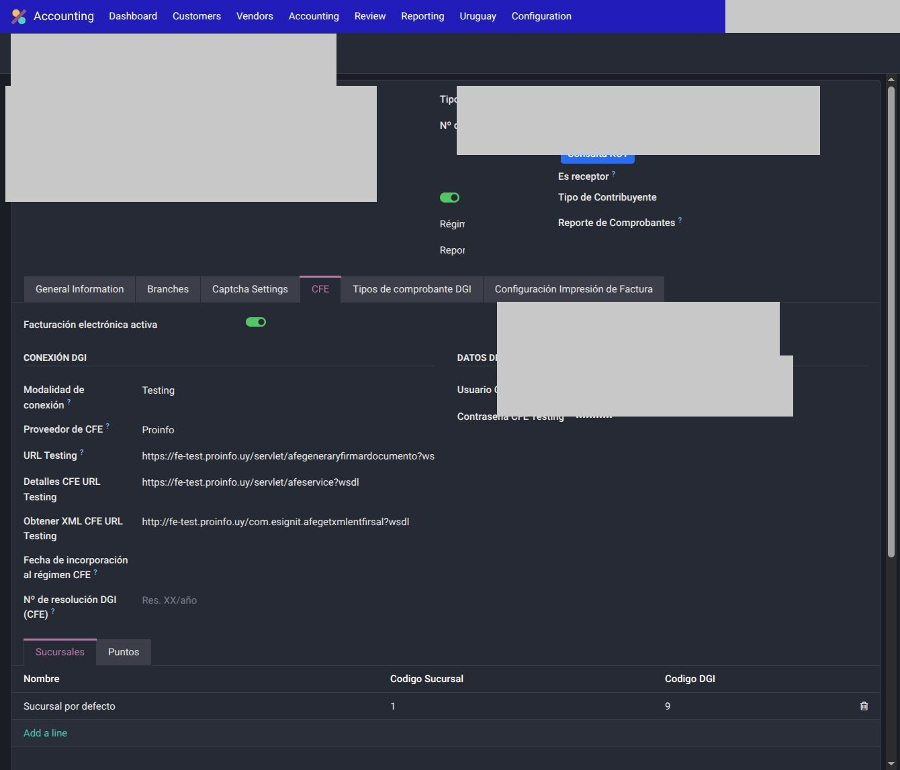
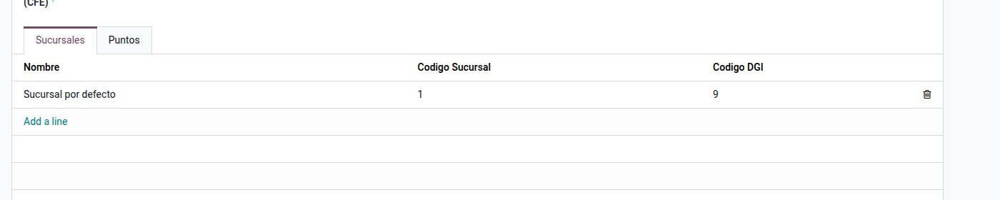
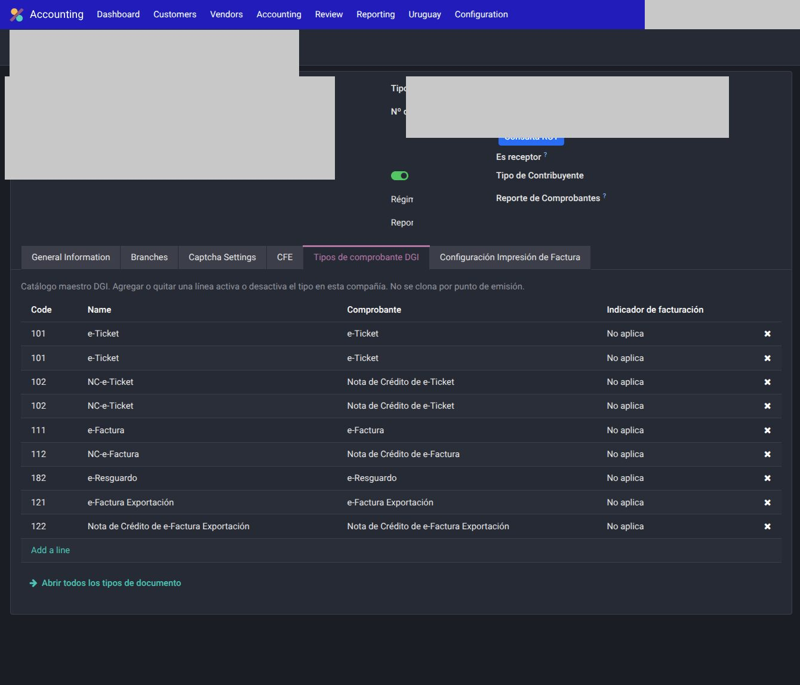

# Configuración — Uruguay

Seteo **por compañía**, la primera vez. No copies certificados, CAE ni diarios de otra empresa.

Orden recomendado:

1. País fiscal y datos del emisor
2. Facturación electrónica (CFE)
3. Sucursales y puntos de emisión
4. Tipos de comprobante DGI
5. [Cuentas, diarios e impuestos](cuentas.md)
6. Una factura de prueba en **Testing**

---

## 1. Compañía

Ve a `Ajustes → Empresas` y abrí la compañía (o creá una nueva). El país fiscal **Uruguay** habilita la pestaña CFE:

1. **País fiscal:** Uruguay. Sin esto no aparecen menús ni validaciones CFE.
2. **Moneda** de la compañía (habitualmente UYU; el USD se opera como moneda de transacción).
3. **RUT** en el campo nativo `vat`, con el tipo de documento RUT.
4. **Razón social** y **nombre de fantasía** (van al CFE).
5. Dirección, ciudad y datos de contacto del emisor.
6. **Tipo de contribuyente:** régimen general o monotributo, según la empresa.

!!! tip
    El RUT se carga como en cualquier contacto Odoo (`vat`). No inventes un campo paralelo.

!!! warning
    En este manual no se publican RUT reales. En demo usá un placeholder o un RUT de prueba del ambiente Testing.

---

## 2. Pestaña CFE

En la misma ficha de compañía, pestaña **CFE** (solo si el país fiscal es Uruguay).

| Campo | Qué hace |
|-------|----------|
| **Facturación electrónica activa** | Prende o apaga la comunicación CFE. Apagado = no emite ni consulta al conector. |
| **Proveedor de factura electrónica** | Conector homologado. Las opciones las agrega el módulo del conector (p. ej. Proinfo). |
| **Modalidad de conexión** | **Testing** o **Producción**. |
| **URL Testing / URL Producción** | Web Service del conector. En desarrollo, solo Testing. |
| **Usuario / contraseña / API key** | Credenciales del **ambiente activo**. Hay slot Testing y slot Producción: no los mezcles. |
| **Fecha de incorporación al régimen** o **Nº de resolución DGI** | Pie del comprobante (“Fecha emisor”). Si hay resolución, esa pisa a la fecha. |

Al activar FE, Odoo exige las credenciales del ambiente que esté seleccionado.

!!! danger "Secretos"
    Usuario, contraseña, API key y CAE **no van a git ni a este sitio**. Viven solo en la compañía.

---

## 3. Sucursales y puntos de emisión

En la pestaña CFE (notebook) o en `Contabilidad → Uruguay`:

1. Creá al menos una **sucursal** DGI (código de casa que espera DGI, no un depósito de stock).
2. Creá al menos un **punto de emisión** ligado a esa sucursal.
3. Asigná el punto al **diario de ventas** que va a emitir CFE.

    

El número fiscal (serie + número) lo maneja el punto / el conector según el tipo de CFE. No tipear el número a mano en una factura ya confirmada.

---

## 4. Tipos de comprobante DGI

`Contabilidad → Configuración → Tipos de documento` (Latam) y, en la compañía, los tipos **activos** para esa empresa (pestaña **Tipos de comprobante DGI**).

Los más usados en emisión:

| Comprobante | Código DGI (orientativo) |
|-------------|--------------------------|
| e-Ticket | 101 |
| e-Factura | 111 |
| NC e-Ticket / e-Factura | 102 / 112 |
| ND e-Ticket / e-Factura | 103 / 113 |
| e-Factura exportación | 121 |
| e-Remito | 181 |
| e-Resguardo | 182 |

Cada diario de venta se ata al tipo que debe emitir (e-Factura vs e-Ticket, etc.).

---

## 5. Consulta RUT

En el **contacto**, con tipo RUT y número cargado: acción de consulta (módulo `l10n_uy_vat_query`). Completa o valida razón social y estado ante DGI.

No hace falta pegar padrones de un cliente en el repositorio: la consulta corre contra el servicio configurado.

---

## 6. Prueba en Testing

Antes de pasar a Producción:

1. Compañía en **Testing**, FE activa, sucursal + punto + diario.
2. Partner de prueba con RUT (o consumidor final, si corresponde e-Ticket).
3. Factura en el diario CFE → **Confirmar**.
4. Revisar estado CFE (aceptado / observado / rechazado).
5. **Imprimir** (un solo botón nativo) y **Enviar** (flujo nativo de Odoo).

Pasar **Modalidad de conexión** a Producción es una decisión explícita de go-live, no un default.

---

## Véase también

- [Cuentas, diarios e impuestos](cuentas.md)
- [Uso](uso.md)
- [Conciliación DGI](conciliacion.md)
