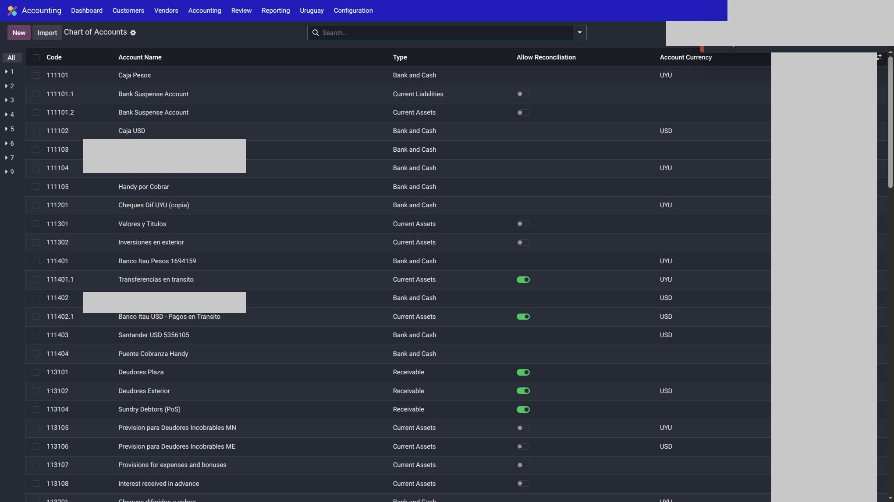
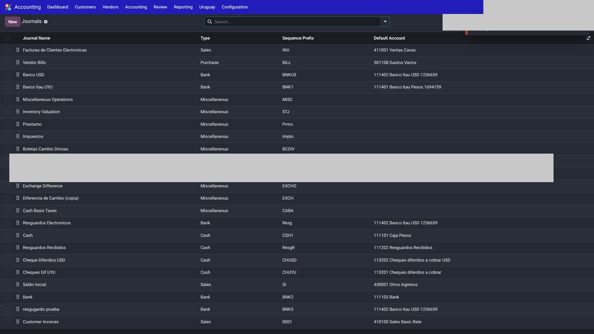
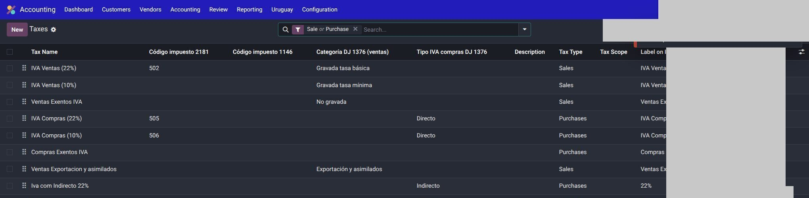

# Cuentas, diarios e impuestos — Uruguay

La localización no reemplaza el plan de cuentas nativo de Odoo: lo **usa**. Cada compañía tiene el suyo.

!!! warning
    No copies el plan, los códigos ni los diarios de otra empresa. Instalás el chart Uruguay y lo afinás con el contador de **esa** compañía.

---

## Plan de cuentas

1. Con la compañía activa: instalar / verificar el plan Uruguay (localización + Accounting).
2. `Contabilidad → Configuración → Plan de cuentas`.

    

3. Revisar cuentas de clientes, proveedores, IVA débito/crédito, redondeo y diferencia de cambio.

Los reportes DGI leen **líneas de impuesto** y cuentas de IVA/IRPF, no “el diario mágico”. Un M2M de “diarios para reportes”, si existe, es **filtro opcional**: vacío = todos.

---

## Diarios

`Contabilidad → Configuración → Diarios`.

| Tipo | Para qué en UY |
|------|----------------|
| Ventas | Emite CFE. Debe tener tipo de documento DGI y punto de emisión. |
| Compras | Facturas proveedor / CFE recibidos. Diario específico para recibidos si la compañía lo define. |
| Banco / caja | Pagos nativos. No mezclar con diarios de un cliente (p. ej. cobranzas bancarias propias). |
| Varios | Ajustes, diferencia de cambio, asientos de impuesto a mano. |

Checklist por diario de **ventas**:

1. Compañía correcta (multi-empresa).
2. Tipo de documento CFE (e-Factura, e-Ticket, …).
3. Punto de emisión DGI.
4. Secuencia: la fiscal la gobierna CFE; no pelees con un número manual.

En la compañía podés setear el **diario para comprobantes recibidos** (compras).

---

## Impuestos

`Contabilidad → Configuración → Impuestos`.

1. IVA tasas vigentes del plan Uruguay.
2. Cuentas de débito y crédito fiscal coherentes con el CoA de **esta** compañía.
3. Posiciones fiscales si hay exportación / no gravado.
4. Retenciones / IRPF solo si el circuito de esa empresa las usa.

!!! tip
    En la factura, el impuesto de la línea es el que viaja al CFE y el que después sale en reportes DGI. Si el tax está mal mapeado, el XML y el 2181/1146 van a mentir.

---

## Redondeo y tipo de cambio

- **Redondeo en la venta:** flag en la compañía si aplica la política de redondeo comercial.
- **TC en facturas de proveedor:** flag para mostrar el tipo de cambio en compras.
- **Diferencia de cambio:** módulo UY aparte; cuentas y diarios **por compañía**.

---

## Véase también

- [Configuración CFE](configuracion.md)
- [Uso](uso.md)
