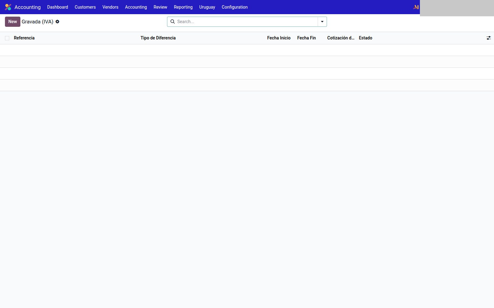
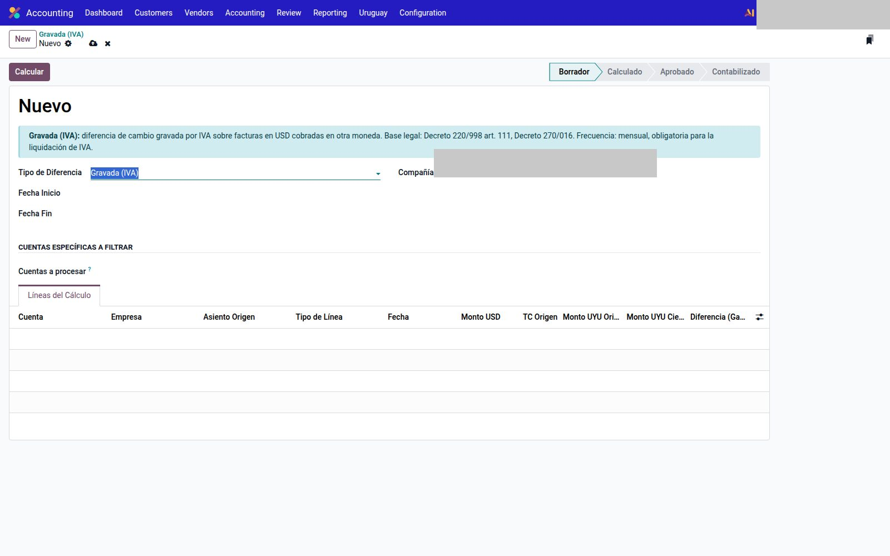

# Diferencia de cambio — Uruguay

Módulo `l10n_uy_exchange_difference`. Cálculo **normativo** (IVA / IRAE), no el revalúo nativo de Odoo. El menú Enterprise *Ganancias/pérdidas de moneda no realizadas* queda desactivado a propósito.

`Contabilidad → Uruguay → Diferencia de Cambio`.

---

## Cuatro circuitos

| Menú | Qué calcula | Cotización |
|------|-------------|------------|
| **Gravada (IVA)** | Diferencia gravada por IVA sobre facturas USD cobradas en otra moneda. Mensual, para la liquidación de IVA. | La toma el cálculo (no se pide cotización a mano) |
| **Activo — Renta Gravada** | Revalúo de saldos USD de activo gravado por IRAE | Cotización de cierre, obligatoria |
| **Activo — Renta No Gravada** | Revalúo de activo no gravado. La pérdida no es deducible (salvo deudores de exportación, caso a caso) | Cotización de cierre |
| **Pasivos** | Revalúo de pasivos USD. El resultado **no** entra directo a IRAE: el prorrateo vive en los reportes DGI | Cotización de cierre |

Cuentas y diarios: **por compañía**, en `Contabilidad → Configuración → Ajustes` → bloque *Localización Uruguay — Diferencia de Cambio*:

- Diario de diferencia de cambio
- Cuenta gravada (IVA)
- Cuenta IVA de la diferencia
- Cuenta ganancia / pérdida

Ahí también está el cron opcional (tipo + día).

---

## Cómo correr un período

1. Entrá al menú del **tipo** que corresponde (no mezcles gravada IVA con revalúo de activo).
2. **Nuevo.** Fecha desde / hasta. En los tres revalúos, cargá la **cotización** de cierre.
3. `Cuentas específicas a filtrar` es opcional: vacío = las cuentas del tipo.
4. **Calcular.** Revisá las líneas (cuenta, partner, factura, USD, UYU origen/cierre, diferencia).
5. **Aprobar.**
6. **Generar asiento.** Recién ahí hay movimiento contable.
7. Si el asiento está mal: **Anular** (revierte y vuelve a borrador; no se deshace a medias).

Estados: Borrador → Calculado → Aprobado → Contabilizado.

No copies el diario ni las cuentas de otra empresa de la misma base.

---

## Véase también

- [Reportes DGI](reportes.md) (el prorrateo de pasivos)
- [Cuentas e impuestos](cuentas.md)
