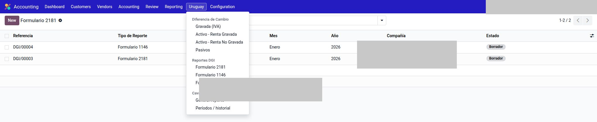
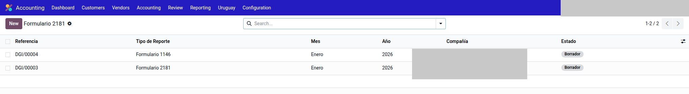
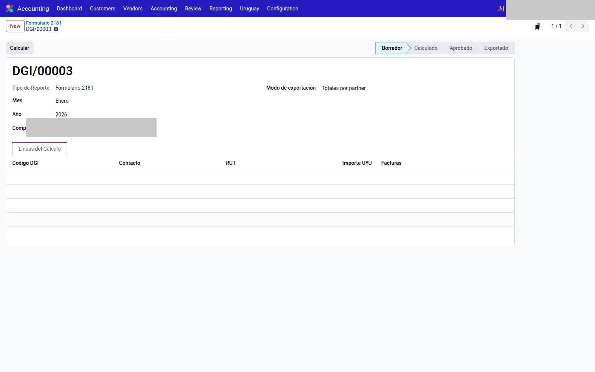
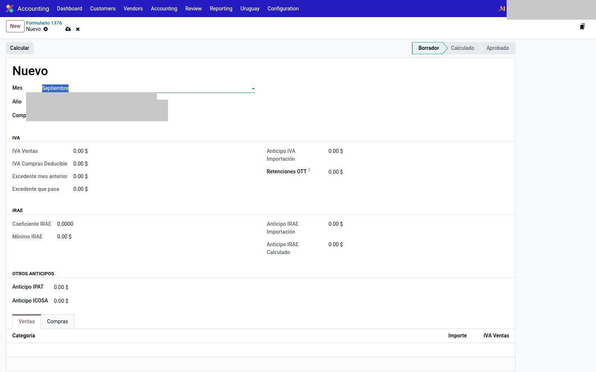

# Reportes DGI

Módulo `l10n_uy_tax_reports`. Genera el **2181**, el **1146** y la liquidación **1376** de **esta** compañía.

`Contabilidad → Uruguay → Reportes DGI`.

El filtro de diarios en Ajustes es **opcional**: vacío = todos los diarios de la compañía. El 1376 no se “arregla” eligiendo un diario: lee el diseño contable (cuentas e impuestos mapeados).

---

## Antes de calcular

En `Contabilidad → Configuración → Ajustes` (compañía fiscal Uruguay):

1. **Diarios para Reportes DGI** — filtro opcional.
2. **Cuenta Retención IRPF** — si esa empresa usa IRPF.
3. Bloque **DJ 1376 — Anticipos**: coeficiente y mínimo IRAE, anticipos IPAT / ICOSA, cuentas de importación.

En cada impuesto (`Contabilidad → Configuración → Impuestos`):

| Campo | Para qué |
|-------|----------|
| Línea 2181 | Agrupa el tax en el 2181 |
| Línea 1146 | Agrupa el tax en el 1146 |
| Categoría DJ 1376 (venta) | Clasifica ventas de la liquidación |
| Tipo IVA compras 1376 | Clasifica compras de la liquidación |

Si el tax no está mapeado, el XML CFE puede estar bien y el reporte igual sale incompleto.

---

## 2181 y 1146

Misma pantalla, distinto tipo. Menús:

- `Contabilidad → Uruguay → Reportes DGI → Formulario 2181`
- `Contabilidad → Uruguay → Reportes DGI → Formulario 1146`

1. **Nuevo**. Mes, año y compañía.
2. **Modo de exportación:** totales por partner o detalle por factura.
3. **Calcular.** Revisa las líneas (partner, RUT, importe). **Ver detalle** abre las facturas que alimentan esa línea.
4. **Aprobar.**
5. **Exportar TXT.** El archivo queda en el formulario.

Estados: Borrador → Calculado → Aprobado → Exportado. **Volver a Borrador** si hay que recalcular.

El 1146 usa el mismo circuito.

No se publica el TXT ni el RUT de la compañía.

---

## Formulario 1376

`Contabilidad → Uruguay → Reportes DGI → Formulario 1376`.

Es la liquidación / anticipos (IVA + IRAE). No exporta TXT en esta pantalla.

1. **Nuevo.** Mes, año, compañía.
2. **Calcular.** Completa IVA ventas, compras deducibles, excedente, anticipos e IRAE.
3. Revisá pestañas **Ventas** y **Compras**.
4. **Aprobar.**

`Retenciones OTT`, `IPAT` e `ICOSA` se pueden completar a mano si el cálculo no los trae.

---

## Véase también

- [Diferencia de cambio](diferencia-cambio.md)
- [Cuentas e impuestos](cuentas.md)
- [Uso](uso.md)
