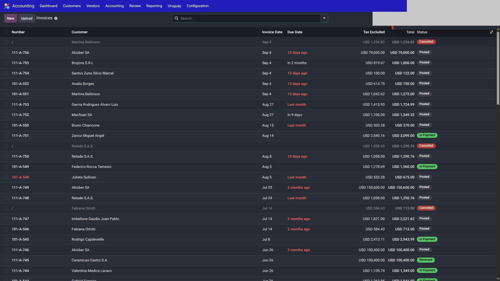
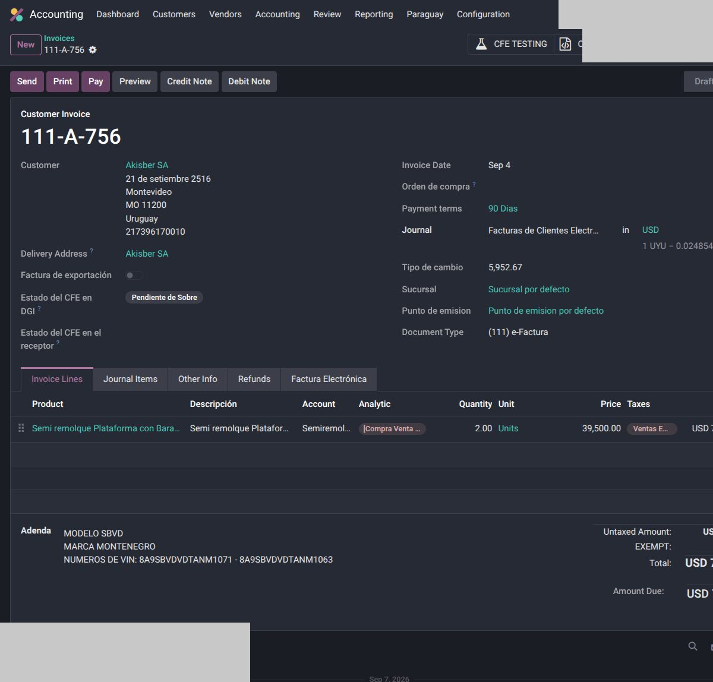
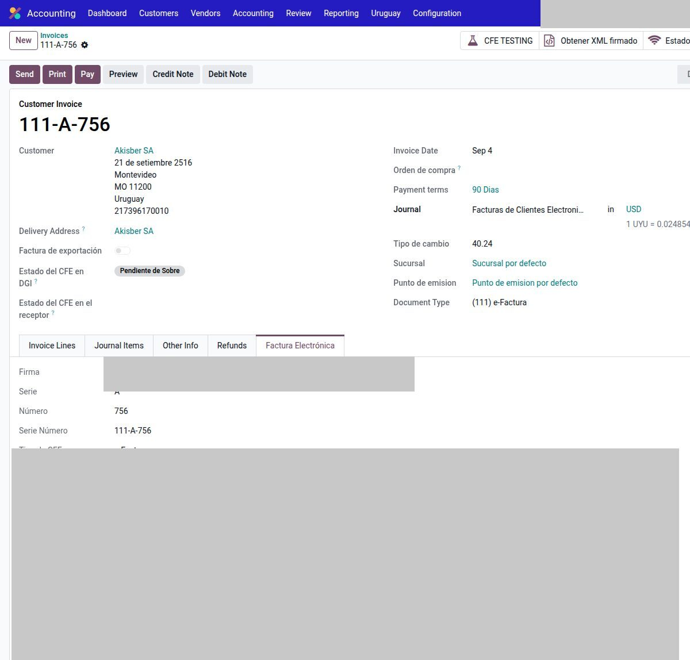
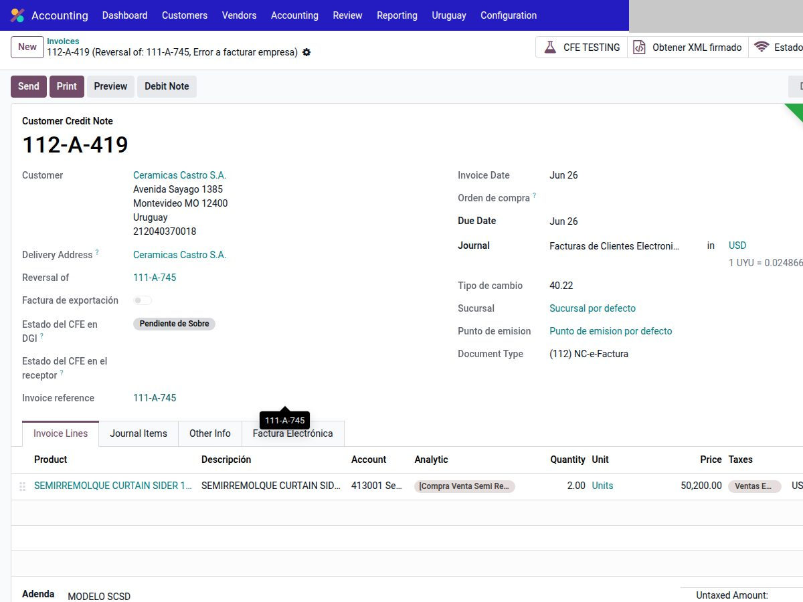
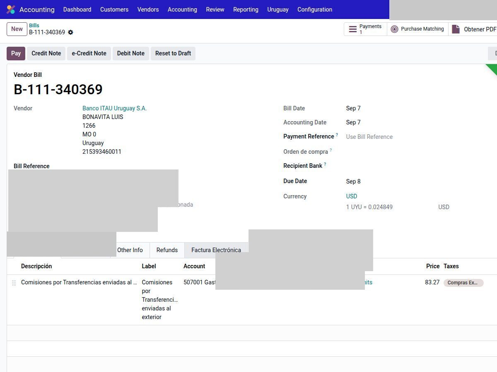
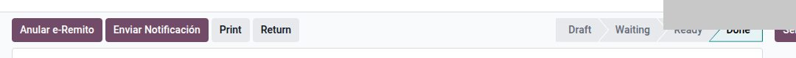
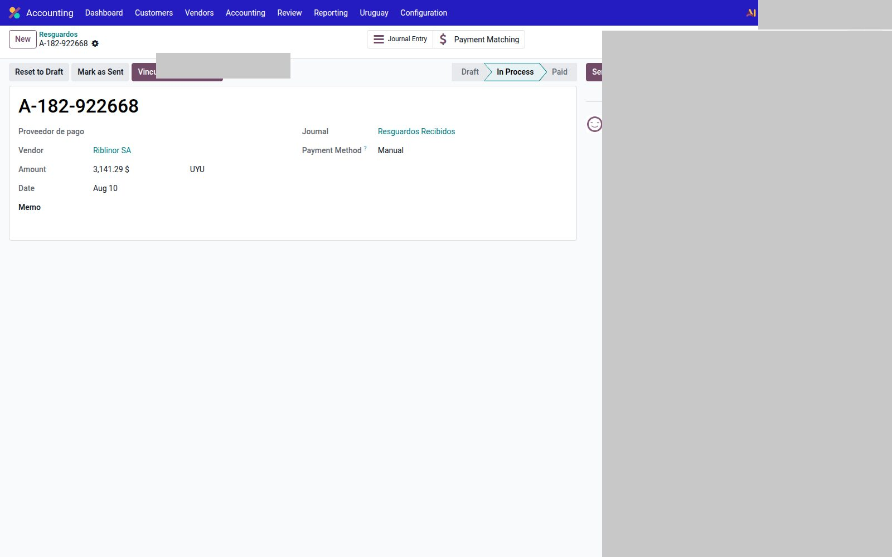
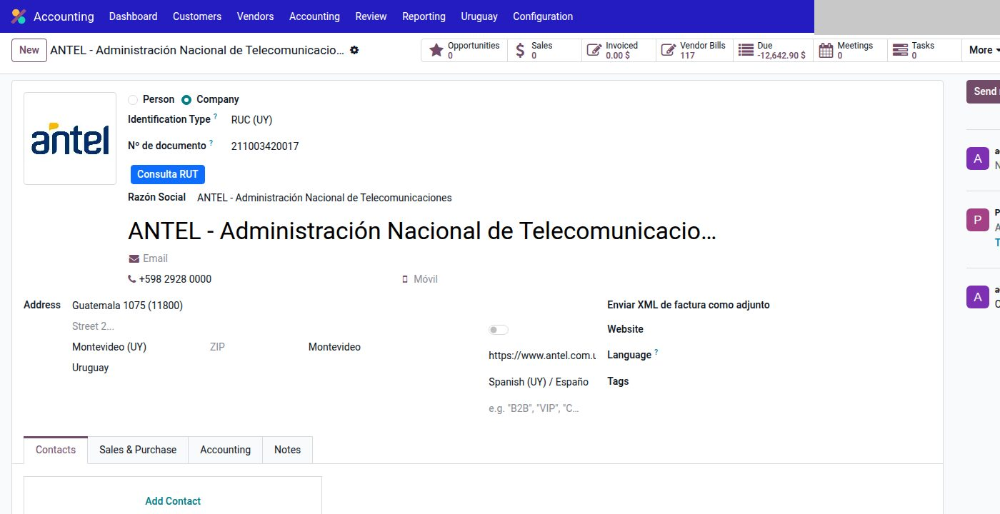

# Uso — Uruguay

Operación diaria con CFE ya configurado en **Testing** (o Producción, si esa compañía ya está en go-live).

!!! tip "Un solo camino"
    **Imprimir** y **Enviar** son los botones nativos de Odoo. No hay un segundo botón “PDF CFE”. Cuando el comprobante está emitido, el PDF default **es** el CFE.

---

## Factura de cliente

1. `Contabilidad → Clientes → Facturas` → Crear.

    
2. Elegí el **diario de ventas** CFE (define tipo e-Factura / e-Ticket y el punto).
3. Partner: RUT si es e-Factura; consumidor final si es e-Ticket (según reglas DGI).
4. Líneas, impuestos, plazo de pago.
5. **Confirmar.** Odoo arma el CFE y lo manda al conector (Testing o Producción según la compañía).
6. Esperá el estado (aceptado / observado / rechazado). El detalle queda en el chatter y en los campos CFE del move.

    

En la pestaña **Factura Electrónica** del mismo comprobante: serie, número, tipo CFE, sucursal y punto. CAE y firma no se publican.

    

Si DGI/el conector **rechaza**: corregí el motivo y volvé a confirmar según el circuito del conector (no inventes un número a mano).

### Imprimir

Botón **Imprimir** (nativo). Con CFE aceptado, sale la representación impresa / PDF del proveedor, no un QWeb genérico paralelo.

### Enviar

Botón **Enviar** (asistente nativo `account.move.send`). Usá una **plantilla de correo** de la compañía (asunto y cuerpo editables). No hardcodear el mail al cliente en código.

---

## Nota de crédito y débito

DGI exige vincular la NC/ND al comprobante original.

1. Desde la factura: acción nativa **Nota de crédito** (o débito, si aplica).
2. No armes una NC suelta “parecida”: el vínculo al origen se pierde y DGI la observa.
3. Mismo diario / familia de tipo (NC de e-Factura vs NC de e-Ticket).

    

---

## Factura de proveedor

1. `Contabilidad → Proveedores → Facturas`.
2. Diario de compras. Si llegó por bandeja CFE, suele crearse en borrador: revisá cuentas e impuestos y confirmá.
3. Serie, número y tipo DGI del **proveedor** (numeración ajena).
4. Conciliación contra el listado DGI: ver [Conciliación](conciliacion.md).

    

---

## e-Remito (181)

**Validar** el albarán no emite el CFE. Primero queda Hecho; después **Emitir Comprobante**.

En el tipo de operación (`Inventario → Configuración → Tipos de operación`): **Utiliza Facturación electrónica**, sucursal y punto.

1. Entrega / transferencia con ese tipo. **Validar** (estado Hecho).
2. Revisá tipo 181, sucursal y punto.
3. **Emitir Comprobante.** Esperá estado DGI. Pestaña Factura Electrónica + PDF.
4. **Imprimir** usa la representación del remito (sin importes de venta).
5. **Anular e-Remito** (indicador DGI 8). No alcanza un `cancel` de stock.

---

## e-Resguardo (182)

Retenciones en el circuito de pagos. Diario con flag **diario resguardo**.

| Menú | Qué es |
|------|--------|
| `Contabilidad → Clientes → Resguardos emitidos` | 182 que emitís |
| `Contabilidad → Proveedores` → resguardos recibidos | 182 que te emitieron (bandeja CFE) |
| `Contabilidad → Proveedores` → anulación de resguardo | 182 de anulación, vinculado al original |

1. Crear el resguardo (o llega por XML).
2. Confirmar / publicar: emite el CFE.
3. Anular: **Anular Resguardo** arma el documento de anulación. La conciliación del original **no** se revierte sola: hay que desconciliar a mano.

El PDF de representación puede tener límites: priorizá XML y estado DGI.

---

## Consulta RUT en el día a día

En el contacto: tipo RUT + número → **Consulta RUT**. Sirve antes de facturar para no emitir contra un RUT inválido.

---

## Reportes DGI

El circuito completo (calcular, aprobar, TXT / 1376) está en [Reportes DGI](reportes.md). El menú: `Contabilidad → Uruguay`.

---

## Véase también

- [Configuración](configuracion.md)
- [Conciliación DGI](conciliacion.md)
- [Reportes DGI](reportes.md)
- [Diferencia de cambio](diferencia-cambio.md)
